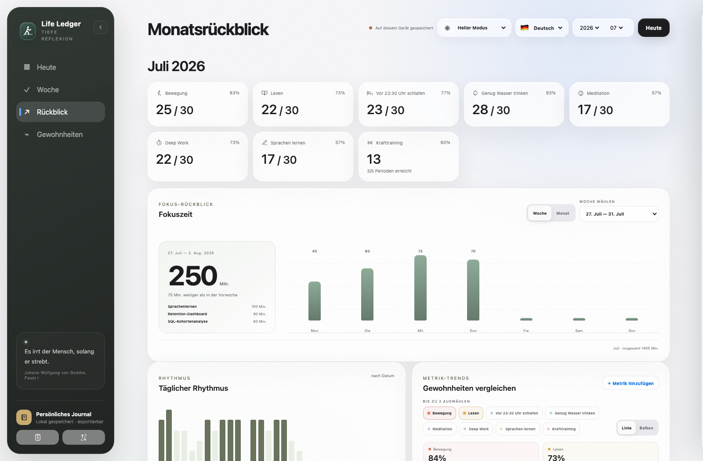
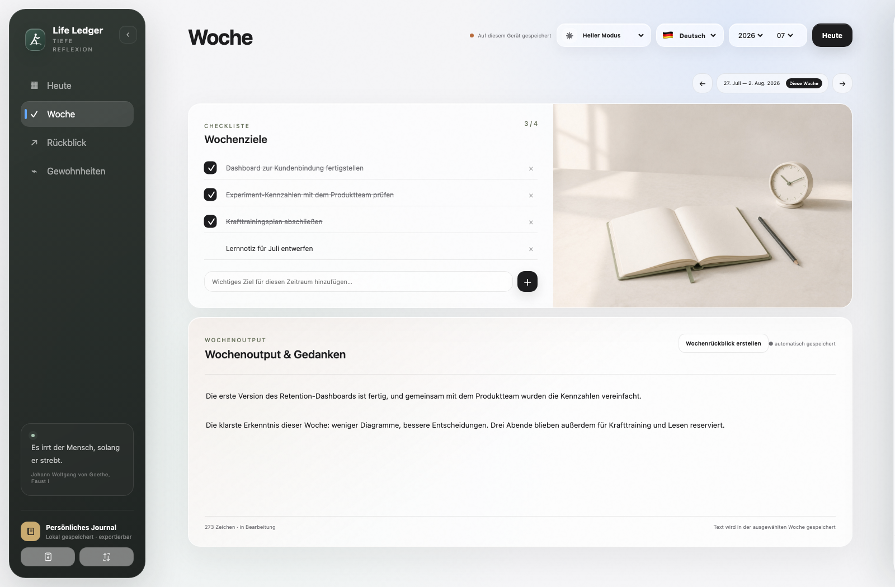
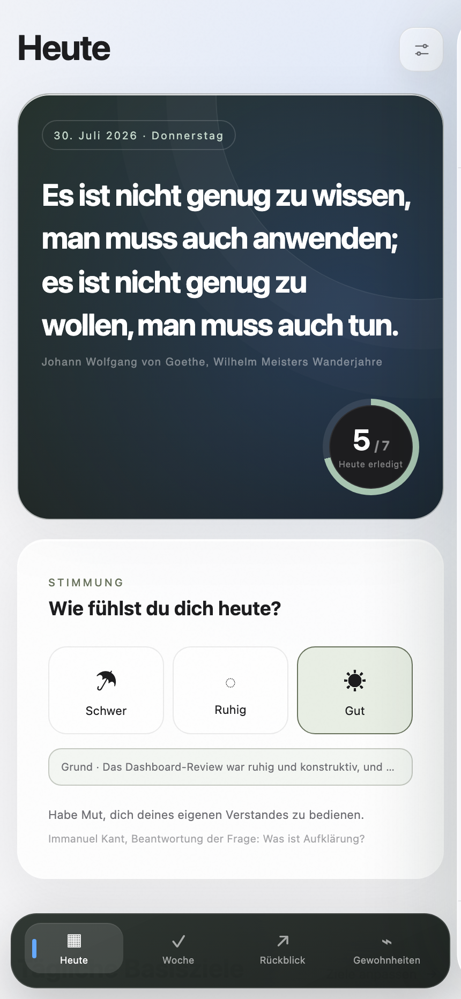
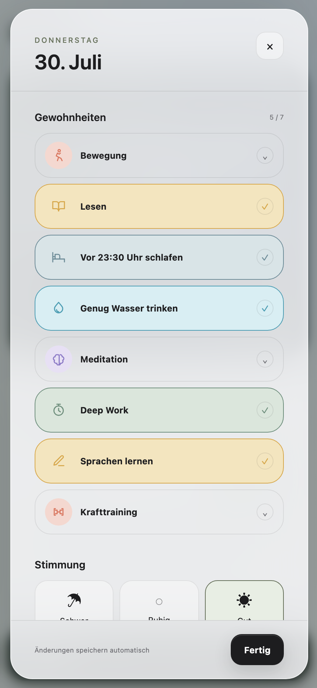

<div align="center">
  
  <h1>Life Ledger · Deep Review</h1>
  <p><strong>Verstehe deine Vergangenheit. Gestalte deine Zukunft.</strong></p>
  <p><em>Ein persönliches Reflexionssystem, das dir hilft, deine Vergangenheit zu verstehen – nicht nur deine Zukunft zu planen.</em></p>

  <p>
    <strong><a href="README.md">English</a></strong> ·
    <strong><a href="README.zh-CN.md">简体中文</a></strong> ·
    <strong><a href="README.de-DE.md">Deutsch</a></strong>
  </p>

  <p>
    <a href="https://zubin-li.github.io/life-ledger-deep-review/?mode=local&amp;lang=de">
      
    </a>
    <a href="https://deploy.workers.cloudflare.com/?url=https://github.com/zubin-li/life-ledger-deep-review">
      
    </a>
  </p>
</div>

> **Stabile Version:** Life Ledger 1.1 ergänzt die selbst bereitgestellte Cloudflare-Version um KI-gestützte Sprachreflexion. Lokale Einträge werden weiterhin automatisch gespeichert; vollständige JSON-Sicherungen lassen sich auf einem anderen Gerät oder in einem anderen Browser wiederherstellen.

> **Neu auf main:** stimmungsfarbiger Kalender, private Erinnerungs-Zeitleiste, langfristige Einträge in der Seitenleiste und optionale Fotoerinnerungen mit übertragbarer Monatssicherung. Fotospeicherung ist nur in der eigenen Cloudflare-Bereitstellung aktiv.

## Neu in Life Ledger 1.1

- **Schnell aufnehmen:** Sprich einige Minuten, prüfe den von der KI geordneten Entwurf und füge ihn der Tagesreflexion hinzu.
- **Zwei Google-Konten:** Verbinde bis zu zwei Google-Calendar-Konten und wähle aus, welche Kalender in Life Ledger erscheinen.
- **Schreibgeschützter Tageskalender:** Einmalige Termine bleiben sichtbar, wiederkehrende Routinen können eingeklappt bleiben; Life Ledger verändert Google Calendar nicht.
- **Ruhigere Heute-Ansicht:** Tageskalender und Reflexion teilen sich den Raum gleichmäßig, ohne ein doppeltes Tagesziele-Modul.
- **Übertragbare Historie:** Validierter JSON-Export und Wiederherstellung erleichtern den Wechsel zwischen Geräten und Browsern.

## Warum Life Ledger?

Die meisten Produktivitätswerkzeuge fragen, was du als Nächstes tun solltest.

Life Ledger fragt, was du bereits erlebt hast.

Es bietet einen ruhigen Ort für tägliche Gewohnheiten, Stimmung, Prioritäten und wöchentliche Reflexionen. So werden kleine Alltagserlebnisse nach und nach zu einer nachvollziehbaren Geschichte deiner persönlichen Entwicklung.

Das Ziel ist nicht, das Leben in Zahlen zu verwandeln.

Das Ziel ist, es klarer zu verstehen.

Mit der Zeit werden deine Daten wertvoller als einzelne Notizen oder erledigte Aufgaben. Sie zeigen, wie du denkst, wächst, Schwierigkeiten begegnest und dich weiterentwickelst.

Life Ledger folgt einem einfachen Grundsatz:

> **Deine Daten gehören dir. Deine Geschichte gehört dir.**

Nutze Life Ledger vollständig lokal, stelle es in deinem eigenen Cloudflare-Konto bereit oder exportiere deine Daten jederzeit.

Es gibt keine zentrale Plattform, keine Werbung und keine zentrale Datenbank.

## Deep Review

Deep Review ist die Methode hinter Life Ledger.

Statt immer mehr Informationen zu sammeln, fördert sie eine regelmäßige Reflexion.

Aus kleinen täglichen Einträgen entstehen Wochenrückblicke. Aus Wochenrückblicken entsteht ein besseres Verständnis für den Monat. Mit der Zeit werden Monate zu einer persönlichen Geschichte, in der Entwicklung sichtbar bleibt, statt in Vergessenheit zu geraten.

Es geht nicht um Produktivität.

Es geht um Perspektive.

## KI-gestützte Reflexion

Life Ledger hält deinen Weg fest. KI hilft dir, ihn zu verstehen.

In einer selbst bereitgestellten Cloudflare-Version verwandelt **Schnell aufnehmen** einen gesprochenen Check-in in eine klare, bearbeitbare Tagesreflexion. Cloudflare Workers AI transkribiert die Aufnahme, entfernt sprachliche Wiederholungen und ordnet ausschließlich das, was du tatsächlich gesagt hast. Erst nach deiner Bestätigung wird der Entwurf zum heutigen Journal hinzugefügt.

Ein zusätzlicher AI-API-Schlüssel ist nicht erforderlich. Die Aufnahme wird nur vorübergehend verarbeitet und weder in Life Ledger noch in D1, Synchronisierungsdaten oder Sicherungen gespeichert. Nur der von dir bestätigte Text wird Teil deiner Historie.

KI soll Reflexion nicht ersetzen, sondern sie bedeutungsvoller machen.

> **Hinweis zur Bereitstellung:** Die KI-Sprachreflexion ist bewusst nur in der selbst bereitgestellten Cloudflare-Version verfügbar. Die lokale und die CloudBase-Version bleiben ohne KI vollständig nutzbar.

## Funktionen

- Tägliche Gewohnheiten mit anpassbaren Zielen und Gültigkeitsdatum
- Schreibgeschützter Tageskalender, Stimmung, Journal und Ereignisnotizen
- Sprachtranskription und KI-gestützte Überarbeitung mit bearbeitbarer Vorschau
- Wochenziele, Checklisten, Wochenrückblicke und archivierte Notizen
- Monatsrückblick mit Gewohnheitsvergleich sowie Linien- und Balkendiagrammen
- Validierte JSON-Sicherung und geführte Wiederherstellung, einschließlich früherer Exportformate
- Benutzeroberfläche auf Englisch, vereinfachtem Chinesisch und Deutsch
- Helles, dunkles und systemabhängiges Erscheinungsbild
- Installierbare PWA mit offline verfügbarem App-Grundgerüst
- Optionale geräteübergreifende Synchronisierung über Cloudflare Access und D1
- Optionaler schreibgeschützter Google-Kalender aus bis zu zwei Konten
- Stimmungsfarbiger Kalender und optionale Erledigungs-Heatmap
- Private Fotoerinnerungen, Zeitleiste und monatliche `.llmedia`-Sicherung in der Cloudflare-Version
- Kompakte langfristige Einträge in der Desktop-Seitenleiste
- Optionale Tencent-CloudBase-Synchronisierung für Festlandchina
- Responsive, von Apple inspirierte Oberfläche für Desktop und Mobilgeräte

## Produkt-Tour

<p align="center">
  
</p>

<p align="center"><sub>Ein Monat auf einen Blick: Rhythmus, Gewohnheitsvergleich und eine Reflexion, die den Zahlen ihren Zusammenhang gibt.</sub></p>

<table>
  <tr>
    <td width="50%"></td>
    <td width="50%"></td>
  </tr>
  <tr>
    <td><strong>Klarheit für den Tag</strong><br />Sieh den echten Tageskalender und halte deine Gedanken direkt daneben fest, ohne Pläne doppelt zu pflegen.</td>
    <td><strong>Richtung für die Woche</strong><br />Verbinde wichtige Aufgaben und den schriftlichen Wochenrückblick in einem ruhigen Arbeitsbereich.</td>
  </tr>
</table>

<p align="center">
  
  
  
</p>

<p align="center"><strong>Für kleine Bildschirme gestaltet.</strong> Als installierte PWA nutzt Life Ledger eine untere Navigation und einen fokussierten Tagesrückblick über die gesamte Höhe.</p>

<p align="center"><a href="docs/SHOWCASE.de-DE.md"><strong>Die vollständige Desktop- und Mobilansicht entdecken →</strong></a></p>

<sub>Die Screenshots enthalten ausschließlich fiktive Beispieldaten aus dem Juli 2026.</sub>

## Nutzungsarten

| Variante | Geeignet für | Eigene Domain nötig | Einstiegskosten |
|---|---|---:|---:|
| Nur lokale PWA | Ein Gerät, keine Einrichtung | Nein | Kostenlos |
| Cloudflare + D1 | Internationales Self-Hosting | Nein | Kostenloses Kontingent |
| Tencent CloudBase | Zugriff und private Synchronisierung in Festlandchina | Für persönliche Tests nicht nötig | Kostenlose Umgebung |

### 1. Jetzt verwenden – ohne Einrichtung

Öffne **[Life Ledger – nur lokal](https://zubin-li.github.io/life-ledger-deep-review/?mode=local&lang=de)** in einem aktuellen Browser. Du brauchst weder Konto noch Download, Terminal, Node.js oder Cloud-Konfiguration.

Deine Einträge werden automatisch in diesem Browser auf diesem Gerät gespeichert. Auf dem Smartphone kannst du im Browsermenü **Zum Home-Bildschirm** oder **App installieren** wählen. Dadurch erhältst du eine bildschirmfüllende PWA, deren App-Grundgerüst auch offline verfügbar bleibt.

Bevor du Gerät, Browser oder Browserprofil wechselst, öffne **Sicherung und Wiederherstellung**, exportiere **Gesamter Verlauf**, übertrage die JSON-Datei privat und stelle sie auf dem neuen Gerät wieder her. Dieselbe URL synchronisiert nicht automatisch mehrere Geräte. Für Live-Synchronisierung nutzt du Cloudflare oder CloudBase. Weitere Hinweise stehen unter [Sicherung und Wiederherstellung](docs/backup-and-restore.md).

#### Offline-Vorschau auf dem Desktop

Das GitHub-ZIP bleibt für Quellcode und Desktop-Vorschau verfügbar: **Code → Download ZIP** auswählen, entpacken und `OPEN-LIFE-LEDGER.html` öffnen. Im direkten Dateimodus sind PWA-Installation, Service Worker und Cloud-Synchronisierung absichtlich deaktiviert. Für die langfristige Nutzung auf iPhone oder Android ist dieser Weg nicht empfohlen.

Für eine zuverlässigere lokale Browser-Adresse ohne Projektabhängigkeiten kannst du im Repository-Verzeichnis einen kleinen Server starten:

```bash
python3 -m http.server 4173 --directory public
```

Öffne anschließend `http://localhost:4173`.

### 2. Entwicklungsmodus

```bash
git clone https://github.com/zubin-li/life-ledger-deep-review.git
cd life-ledger-deep-review
npm install
npm run dev
```

Öffne die von Wrangler angezeigte lokale Adresse. Beim ersten Start wird das lokale D1-Schema angelegt. Dieser Modus ist für Änderungen an der Worker-API oder Tests der D1-Integration gedacht.

### 3. Eigene Kopie erstellen

Nutze auf GitHub **Use this template**. Das neue Repository besitzt einen unabhängigen Verlauf und kann angepasst werden, ohne Daten mit diesem Projekt zu teilen.

### 4. Mit Cloudflare bereitstellen

Wähle oben **Deploy to Cloudflare**. Cloudflare kopiert das öffentliche Repository, erstellt in deinem Konto einen Worker und eine D1-Datenbank, führt die Migration aus und stellt die App bereit.

Aktiviere nach der Bereitstellung Cloudflare Access:

1. Öffne in Cloudflare **Workers & Pages**.
2. Wähle den neuen Worker `life-ledger-deep-review`.
3. Öffne **Settings → Domains & Routes**.
4. Wähle neben der `workers.dev`-Route **Enable Cloudflare Access**.
5. Erlaube nur deine E-Mail-Adresse oder vertrauenswürdige Haushaltsmitglieder.
6. Kopiere den **Application Audience (AUD) Tag** der Access-Anwendung.
7. Hinterlege unter **Settings → Variables and Secrets**: `TEAM_DOMAIN` als `https://<dein-team>.cloudflareaccess.com` und `POLICY_AUD` als kopierten AUD-Tag.
8. Öffne die App und authentifiziere dich einmal. Anschließend verwendet die Cloud-Synchronisierung die verifizierte Access-Identität.

Dieselbe Bereitstellung enthält automatisch die Workers-AI-Bindung für **Schnell aufnehmen**. Pro Konto gelten drei Aufnahmen und insgesamt 20 Aufnahmeminuten pro UTC-Tag, bei höchstens 10 Minuten pro Aufnahme. Dadurch bleibt die persönliche Nutzung vorhersehbar. Cloudflare kann Freikontingente und Preise ändern; prüfe vor einer Nutzung mit vielen Personen das eigene Dashboard.

Die Cloudflare-Ausgabe kann Google Calendar außerdem schreibgeschützt einbinden. Dafür werden ein eigener Google-OAuth-Webclient und vier Cloudflare-Secrets benötigt; das Repository enthält keine gemeinsamen Google-Zugangsdaten. Die vollständigen Schritte stehen unter [Self-Hosting](docs/self-hosting.md#optional-read-only-google-calendar).

Die vollständige Anleitung findest du unter [Self-Hosting](docs/self-hosting.md) und [Cloudflare Access einrichten](docs/cloudflare-access.md).

### 5. Mit Tencent CloudBase in Festlandchina bereitstellen

CloudBase ist die empfohlene Variante für Festlandchina. Statische Dateien, E-Mail-OTP-Anmeldung und eine nur für den Ersteller zugängliche Dokumentensammlung laufen in deiner eigenen CloudBase-Umgebung.

Für persönliche Tests reicht die zugewiesene Adresse `*.tcloudbaseapp.com`; zu Beginn sind weder Domainkauf noch ICP-Registrierung nötig. Die aktuelle kostenlose Umgebung arbeitet mit einem monatlichen Ressourcenkontingent und muss regelmäßig manuell verlängert werden. Da sich Bedingungen ändern können, prüfe bitte die verlinkten offiziellen Preisangaben.

Das Repository enthält:

- die CloudBase-CLI-Konfiguration in `cloudbaserc.json`;
- einen Synchronisierungsadapter für das CloudBase Web SDK v3;
- einen Build für Git-basierte Bereitstellung mit `npm run build:cloudbase`;
- eine lokale Ein-Befehl-Bereitstellung mit `npm run deploy:cloudbase`.

Einmalig sind drei Sicherheitseinstellungen in der Konsole erforderlich: eine kostenlose Dokumentdatenbank-Umgebung anlegen, E-Mail-OTP aktivieren und `life_ledger_states` mit der Berechtigung **Nur der Ersteller darf lesen und schreiben** erstellen. Diese Schritte dürfen nicht durch Browsercode automatisiert werden, weil dafür Administrator-Zugangsdaten offengelegt werden müssten.

Die vollständige Anleitung steht im [CloudBase-Leitfaden für Festlandchina](docs/cloudbase-china.md); eine ausführliche chinesische Fassung gibt es [hier](docs/cloudbase-china.zh-CN.md).

## Datenhoheit

```text
Browser / installierte PWA
   ├── localStorage     sofortige lokale Speicherung
   ├── JSON-Sicherung   validierter Export + geführte Wiederherstellung
   └── optionale authentifizierte Synchronisierung
            ├── Cloudflare Worker → deine D1-Datenbank
            └── CloudBase Web SDK → deine Dokumentensammlung
```

Cloud-Synchronisierung ist optional. Eine rein lokale Installation speichert getrennte Daten pro Gerät und Browserprofil. Das Löschen von Website-Daten kann Einträge entfernen; bewahre deshalb datierte Komplettsicherungen auf. Cloudflare prüft ein Access-JWT vor dem Schreiben in D1. CloudBase nutzt eine angemeldete Sitzung und eine nur für den Ersteller zugängliche Sammlung. Journalinhalte sind nicht auf Anwendungsebene Ende-zu-Ende verschlüsselt; der Eigentümer des jeweiligen Cloud-Kontos kann seine eigene Datenbank einsehen. Lies vor dem Speichern sensibler Inhalte [PRIVACY.md](PRIVACY.md).

## Befehle

| Befehl | Zweck |
|---|---|
| `npm run dev` | Lokale Migrationen anwenden und Wrangler im Entwicklungsmodus starten |
| `npm test` | Syntax-, Datenschutzmarker-, Struktur- und Worker-Tests ausführen |
| `npm run check` | Schnelle Repository-Prüfungen ausführen |
| `npm run build:cloudbase` | CloudBase-Artefakt mit `TCB_ENV_ID` und `TCB_ACCESS_KEY` bauen |
| `npm run deploy:cloudbase` | Bauen und zu Tencent CloudBase Static Hosting bereitstellen |
| `npm run db:migrations:apply` | D1-Migrationen auf die konfigurierte entfernte Datenbank anwenden |
| `npm run deploy` | Migrieren und zu Cloudflare bereitstellen |

Entwicklung und Bereitstellung benötigen Node.js 20 oder neuer. Für die direkte lokale Nutzung ist Node.js nicht erforderlich.

## Projektstruktur

```text
public/       Browser-App, PWA-Grundgerüst, Sync-Adapter und visuelle Assets
src/          Cloudflare-Worker-API und Routing statischer Dateien
migrations/   D1-Datenbankschema
scripts/      Validierung sowie CloudBase-Build- und Deployment-Helfer
tests/        leichtgewichtige Worker-Tests
docs/         Self-Hosting- und Datenanleitungen
.github/      CI- und Issue-Vorlagen
```

## Kosten

Life Ledger ist für eine Person oder einen kleinen Haushalt ausgelegt. Beide Cloud-Varianten laufen im eigenen Konto der bereitstellenden Person. Ein normal genutzter persönlicher Tracker sollte innerhalb der kostenlosen Kontingente bleiben; Grenzen und Preise können sich jedoch ändern.

Für Festlandchina bietet CloudBase derzeit eine kostenlose Umgebung mit monatlichem Ressourcenkontingent. Sie kann keine nutzungsabhängige Abrechnung aktivieren und muss regelmäßig manuell verlängert werden. Die zugewiesene Domain ist für Entwicklung und Tests vorgesehen; eine öffentliche Produktionsseite benötigt eine eigene Domain und die erforderliche ICP-Konfiguration. Siehe die [Kosten- und Domainübersicht](docs/cloudbase-china.md#what-it-costs).

## Roadmap

- Druckfertige Wochen- und Monatsrückblicke mit PDF-Speicherung
- Optionale KI-gestützte Wochen- und Monatsauswertung
- Fotoanhänge mit vollständiger Sicherung und Wiederherstellung
- Optionaler Wetterkontext als langfristige Erkundung
- Sicherere Konfliktbehandlung bei gleichzeitigen Offline-Änderungen
- Optionale monatliche Aufteilung für sehr lange Journalverläufe
- Automatisierte Barrierefreiheits- und Browser-Regressionstests
- Weitere Übersetzungen aus der Community

Prioritäten, Datenschutzleitplanken und ausdrückliche Nicht-Ziele stehen in der [Produkt-Roadmap](docs/ROADMAP.md). Die Roadmap beschreibt eine Richtung und kein zugesagtes Veröffentlichungsdatum.

## Mitwirken

Issues und klar abgegrenzte Pull Requests sind willkommen. Bitte lies [CONTRIBUTING.md](CONTRIBUTING.md), [SECURITY.md](SECURITY.md) und das [Changelog](CHANGELOG.md). Lade niemals private Journalexporte in öffentliche Issues hoch.

## Lizenz

Life Ledger steht unter der [MIT-Lizenz](LICENSE). Angepasste Lucide-Pfade sind in [THIRD_PARTY_NOTICES.md](THIRD_PARTY_NOTICES.md) dokumentiert.
