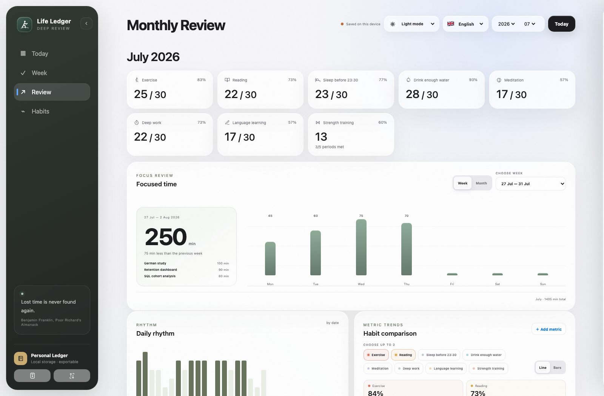
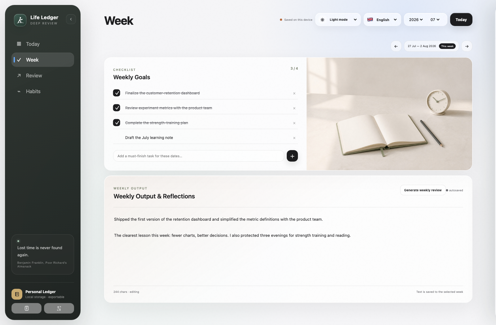
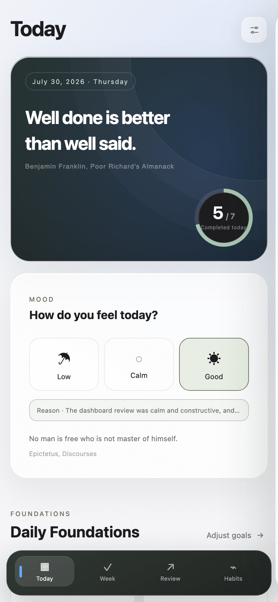
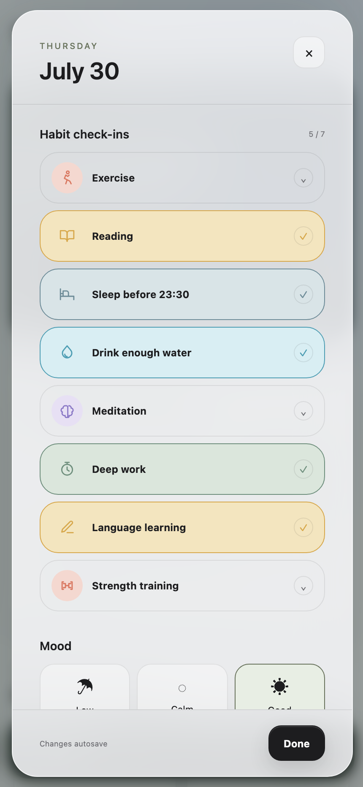

<div align="center">
  
  <h1>Life Ledger · Deep Review</h1>
  <p><strong>Understand your past. Shape your future.</strong></p>
  <p><em>A personal reflection system that helps you understand your past, not just plan your future.</em></p>

  <p>
    <strong><a href="README.md">English</a></strong> ·
    <strong><a href="README.zh-CN.md">简体中文</a></strong> ·
    <strong><a href="README.de-DE.md">Deutsch</a></strong>
  </p>

  <p>
    <a href="https://zubin-li.github.io/life-ledger-deep-review/?mode=local&amp;lang=en">
      
    </a>
    <a href="https://deploy.workers.cloudflare.com/?url=https://github.com/zubin-li/life-ledger-deep-review">
      
    </a>
  </p>
</div>

> **Stable release:** Life Ledger 1.2 connects each selected day with its calendar, habits, mood, reflection, and private memories. Local records still save automatically, and complete backups can be restored on another device or browser.

## What's new in Life Ledger 1.2

- **One selected day, one workspace:** choosing a date now moves the hero, habits, mood, schedule, and reflection together.
- **Read-only calendar context:** connect up to two Google accounts, choose which calendars appear, and keep routine events collapsed when they are not useful.
- **Mood at a glance:** mood-colored month cells and an optional completion heatmap reveal patterns without crowding the calendar.
- **Private photo memories:** add compressed daily photos, revisit them on a chronological Timeline, and move them with monthly `.llmedia` backups.
- **A calmer Today view:** calendar and reflection share an equal layout, while Focus stays available inside the reflection carousel instead of occupying permanent space.
- **Quick record remains deliberate:** speak for a few minutes, review the AI-organized draft, and append it without silently changing habits, mood, or goals.

## Why Life Ledger

Most productivity tools focus on what you should do next.

Life Ledger focuses on what you have already experienced.

It provides a simple place to record your daily habits, mood, priorities, and weekly reflections—allowing small everyday moments to gradually become a meaningful history of your personal growth.

The goal is not to quantify life.

It is to understand it more clearly.

Over time, your own data becomes something far more valuable than isolated notes or completed tasks. It becomes a record of how you think, grow, struggle, and improve.

Life Ledger is designed around a simple principle:

> **Your data belongs to you. Your history belongs to you.**

Deploy it to your own Cloudflare account, keep everything local, or export your data whenever you want.

There is no hosted platform, no advertising, and no central database.

## Deep Review

Deep Review is the methodology behind Life Ledger.

Instead of collecting more information, it encourages a habit of reflection.

Small daily records become weekly reviews. Weekly reviews become monthly understanding. Months eventually become a personal history that helps you see your own growth instead of forgetting it.

The purpose is not productivity.

The purpose is perspective.

## AI-assisted Reflection

Life Ledger records your journey. AI helps you understand it.

In a self-hosted Cloudflare deployment, **Quick record** turns a short spoken check-in into a clear, editable daily reflection. Cloudflare Workers AI transcribes the recording, removes verbal clutter, and reorganizes only what you said. You review the draft before it is appended to today's journal.

No separate AI API key is needed. The recording is processed transiently and is never stored in Life Ledger, D1, synchronization data, or backups. Only the draft you explicitly save becomes part of your history.

AI is not here to replace reflection. It is here to make reflection more meaningful.

> **Deployment note:** AI voice reflection is intentionally available only in the self-hosted Cloudflare edition. The local-only and CloudBase editions remain fully usable without AI.

## Highlights

- Daily habits with adjustable targets and effective dates
- Read-only daily calendar, mood, journal, and event notes
- AI-assisted voice-to-journal reflection with editable review before saving
- Weekly goals, checklist behavior, outputs, and archived notes
- Monthly review with habit comparisons and line/bar charts
- Validated JSON backup and guided restore, including earlier export formats
- English, Simplified Chinese, and German interfaces
- Light, dark, and system appearance
- Installable PWA with offline app shell
- Optional Cloudflare Access + D1 cross-device synchronization
- Optional read-only Google Calendar context from up to two accounts
- Mood-colored calendar days and an optional completion heatmap
- Private photo memories with JPEG/PNG/WebP/HEIC/HEIF support, a chronological timeline, and portable monthly `.llmedia` backups in the Cloudflare edition
- Compact long-term items in the desktop sidebar
- Optional Tencent CloudBase sync for mainland China
- Responsive Apple-inspired interface for desktop and mobile

## Product tour

<p align="center">
  
</p>

<p align="center"><sub>One month, seen clearly: completion rhythm, habit comparisons, and a reflection that keeps the numbers in context.</sub></p>

<table>
  <tr>
    <td width="50%"></td>
    <td width="50%"></td>
  </tr>
  <tr>
    <td><strong>Daily clarity</strong><br />See the day's real calendar and leave a reflection beside it, without duplicating plans.</td>
    <td><strong>Weekly direction</strong><br />Keep must-finish work and the week's written output in one calm workspace.</td>
  </tr>
</table>

<p align="center">
  
  
  
</p>

<p align="center"><strong>Responsive by design.</strong> The installed PWA uses a bottom navigation bar and a focused, full-height daily review on smaller screens.</p>

<p align="center"><a href="docs/SHOWCASE.md"><strong>Explore the complete desktop and mobile product showcase →</strong></a></p>

<sub>The screenshots use fictional July 2026 sample data created only for demonstration.</sub>

## Choose how to use it

| Path | Best for | Domain required | Starting cost |
|---|---|---:|---:|
| Local-only PWA | One device, no setup | No | Free |
| Cloudflare + D1 | International self-hosting | No | Free tier |
| Tencent CloudBase | Mainland China access and private sync | No for personal evaluation | Free environment |

### 1. Use now — no setup

Open **[Life Ledger — Local only](https://zubin-li.github.io/life-ledger-deep-review/?mode=local&lang=en)** in a current browser. No account, download, terminal, Node.js, or cloud setup is required.

Your records save automatically in that browser on that device. On a phone, use the browser menu to choose **Add to Home Screen** or **Install app** for a full-screen PWA that also keeps its app shell available offline.

Before changing device, browser, or browser profile, open **Backup & restore**, export **All history**, move the JSON file privately, and restore it on the new device. A shared URL does not synchronize two devices; use Cloudflare or CloudBase below when you need live cross-device sync. See [Backup and restore](docs/backup-and-restore.md).

#### Desktop offline preview

The GitHub ZIP remains available for source access and desktop preview: choose **Code → Download ZIP**, unzip it, then open `OPEN-LIFE-LEDGER.html`. Direct-file mode intentionally disables PWA installation, Service Worker caching, and cloud sync. It is not the recommended long-term storage path on iPhone or Android.

For a more consistent browser origin without installing project dependencies, start a small local server from the repository folder:

```bash
python3 -m http.server 4173 --directory public
```

Then open `http://localhost:4173`.

### 2. Developer mode

```bash
git clone https://github.com/zubin-li/life-ledger-deep-review.git
cd life-ledger-deep-review
npm install
npm run dev
```

Open the local URL shown by Wrangler. The first start applies the D1 schema locally. This mode is intended for changing the Worker API or testing D1 integration.

### 3. Create your own copy

Use GitHub's **Use this template** button. Your new repository has an independent history and can be customized without sharing data with this project.

### 4. Deploy with Cloudflare

Select **Deploy to Cloudflare** above. Cloudflare will copy the public repository, create a Worker and D1 database in your account, apply the migration, and deploy the app.

After deployment, enable Cloudflare Access:

1. Open **Workers & Pages** in Cloudflare.
2. Select the new `life-ledger-deep-review` Worker.
3. Open **Settings → Domains & Routes**.
4. Next to the `workers.dev` route, select **Enable Cloudflare Access**.
5. Allow only your email address or trusted household members.
6. Copy the Access application's **Application Audience (AUD) Tag**.
7. In the Worker's **Settings → Variables and Secrets**, add `TEAM_DOMAIN` as `https://<your-team>.cloudflareaccess.com` and `POLICY_AUD` as the copied AUD tag.
8. Open the app and authenticate once. Cloud sync will then use the verified Access identity.

The same deployment automatically includes the Workers AI binding used by **Quick record**. The app limits one account to three recordings and 20 recorded minutes per UTC day, with a maximum of 10 minutes per recording, to keep personal use predictable. Cloudflare allowances and pricing can change; review the provider dashboard before broad multi-user use.

The Cloudflare edition can also connect to Google Calendar in read-only mode and keep compressed photo memories in a private R2 bucket. Google Calendar requires your own Google OAuth web client and four Cloudflare secrets; no Google credential is bundled with the repository. Setup steps and the exact privacy boundary are documented in [Self-hosting](docs/self-hosting.md).

See [Self-hosting](docs/self-hosting.md) and [Cloudflare Access setup](docs/cloudflare-access.md) for the complete walkthrough.

### 5. Deploy with Tencent CloudBase in mainland China

CloudBase is the recommended mainland-China path. It uses Tencent-hosted static files, email OTP authentication, and a creator-only document collection in **your own** CloudBase environment.

Personal evaluation can use the assigned `*.tcloudbaseapp.com` address, so no domain purchase or ICP filing is required to get started. The current Free environment does not support pay-as-you-go billing. It includes 3,000 resource points per month and must be renewed manually every six months; policies can change, so always review the linked official pricing page.

The repository includes:

- the maintained CloudBase CLI configuration in `cloudbaserc.json`;
- a CloudBase Web SDK v3 synchronization adapter;
- a Git-deployment build (`npm run build:cloudbase`);
- a one-command local deployment (`npm run deploy:cloudbase`).

There are three one-time safety settings in the deployer's console: create a Free document-database environment, enable email OTP, and create `life_ledger_states` with **Only the creator can read and write** permission. These cannot safely be performed by browser code because that would expose administrator credentials.

Read the complete [Tencent CloudBase deployment guide](docs/cloudbase-china.md) or the detailed [Chinese guide](docs/cloudbase-china.zh-CN.md).

## Data ownership

```text
Browser / installed PWA
   ├── localStorage     immediate local persistence
   ├── JSON backup     validated export + guided restore
   └── optional authenticated sync
            ├── Cloudflare Worker → your D1 database
            └── CloudBase Web SDK → your document collection
```

Cloud synchronization is optional. A local-only installation has separate data per device and browser profile; clearing site data can remove it, so keep dated complete backups. Cloudflare validates an Access JWT before writing to D1; CloudBase uses an authenticated session plus creator-only collection permissions. Journal content is not application-layer end-to-end encrypted, so the owner of either cloud account can inspect their own database. Read [PRIVACY.md](PRIVACY.md) before storing sensitive information.

## Commands

| Command | Purpose |
|---|---|
| `npm run dev` | Apply local migrations and start Wrangler development mode |
| `npm test` | Run syntax, privacy-marker, structure, and Worker tests |
| `npm run check` | Run fast repository checks |
| `npm run build:cloudbase` | Build a CloudBase artifact using `TCB_ENV_ID` and `TCB_ACCESS_KEY` |
| `npm run deploy:cloudbase` | Build and deploy to Tencent CloudBase Static Hosting |
| `npm run db:migrations:apply` | Apply D1 migrations to the configured remote database |
| `npm run deploy` | Migrate and deploy to Cloudflare |

The development and deployment commands require Node.js 20 or newer. Direct local use does not require Node.js.

## Project structure

```text
public/       browser application, PWA shell, sync adapters, and visual assets
src/          Cloudflare Worker API and static-asset routing
migrations/   D1 database schema
scripts/      validation and CloudBase build/deploy helpers
tests/        dependency-light Worker tests
docs/         self-hosting and data guides
.github/      CI and issue templates
```

## Cost expectations

Life Ledger is designed for one person or a small household. Both cloud paths run inside the deployer's own account. A normal personal tracker is expected to remain within the providers' free allowances, but limits and prices can change.

For mainland China, CloudBase currently offers one Free environment with 3,000 resource points per month. It cannot enable pay-as-you-go billing and requires manual renewal every six months. The assigned domain is documented for development/testing; a public production site requires a custom domain and a qualifying ICP setup. See the [cost and domain decision table](docs/cloudbase-china.md#what-it-costs).

## Roadmap

- Print-ready weekly and monthly review reports
- Optional AI-assisted weekly and monthly synthesis
- Print-ready weekly and monthly reports
- Optional weather context as a longer-term exploration
- Safer conflict handling for concurrent offline edits
- Optional monthly partitioning for very long journal histories
- Automated accessibility and browser regression coverage
- Community-contributed translations

See the [product roadmap](docs/ROADMAP.md) for priorities, privacy guardrails, and explicit non-goals. Roadmap items describe direction rather than a promised release date.

## Contributing

Issues and focused pull requests are welcome. Please read [CONTRIBUTING.md](CONTRIBUTING.md), [SECURITY.md](SECURITY.md), and the [changelog](CHANGELOG.md). Never attach private journal exports to public issues.

## License

Life Ledger is released under the [MIT License](LICENSE). Adapted Lucide paths are documented in [THIRD_PARTY_NOTICES.md](THIRD_PARTY_NOTICES.md).
