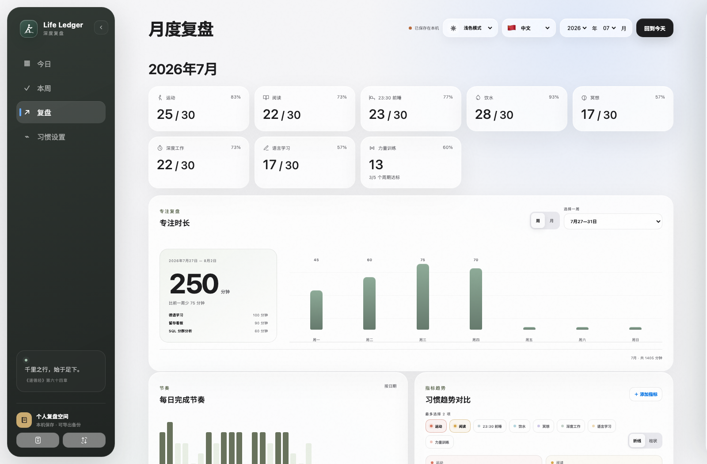
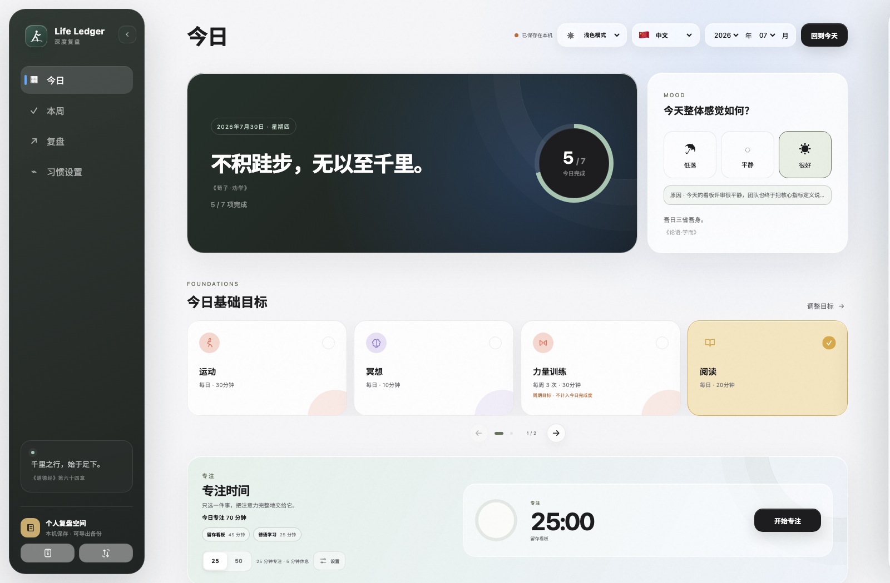
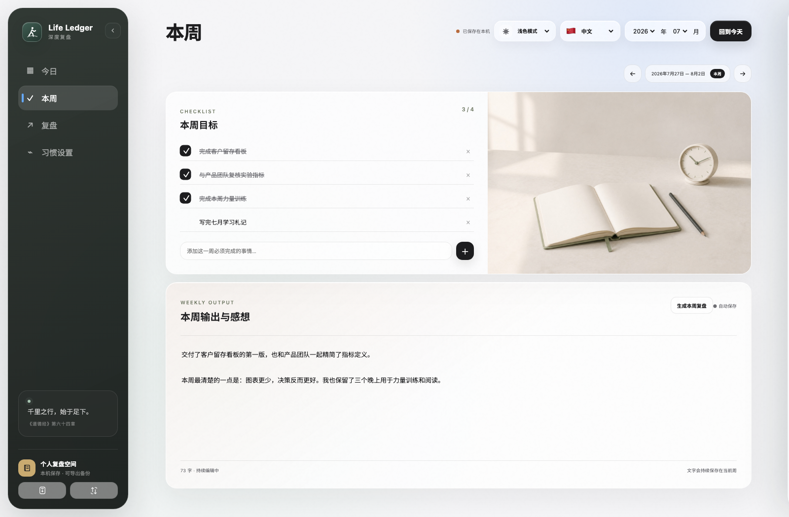
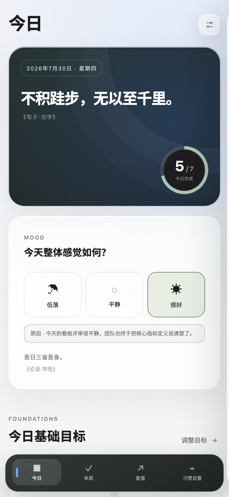
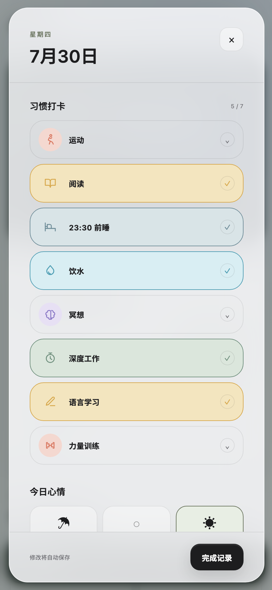
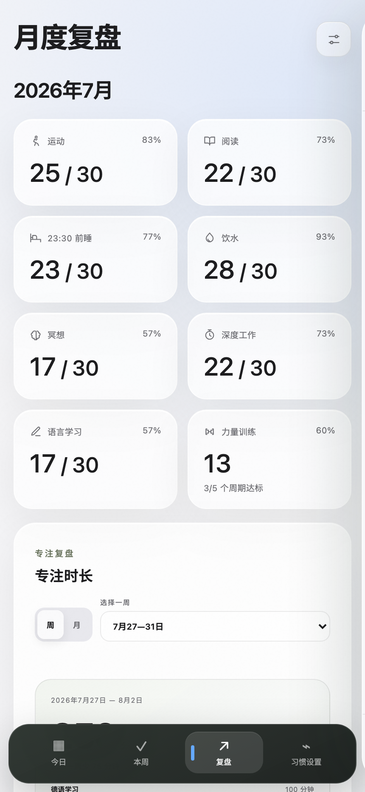

<div align="center">
  
  <h1>Life Ledger · 深度复盘</h1>
  <p><strong>理解过去，塑造未来。</strong></p>
  <p><em>一个帮助你理解过去，而不仅仅规划未来的个人深度复盘系统。</em></p>

  <p>
    <strong><a href="README.md">English</a></strong> ·
    <strong><a href="README.zh-CN.md">简体中文</a></strong> ·
    <strong><a href="README.de-DE.md">Deutsch</a></strong>
  </p>

  <p>
    <a href="https://zubin-li.github.io/life-ledger-deep-review/?mode=local&lang=zh">
      
    </a>
    <a href="docs/cloudbase-china.zh-CN.md">
      
    </a>
  </p>
</div>

> **正式版说明：** Life Ledger 1.1 为自己部署的 Cloudflare 版本加入了 AI 语音复盘。本机记录仍会自动保存，完整 JSON 备份可以在另一台设备或另一个浏览器中恢复。

## 为什么是 Life Ledger？

很多效率工具关注的是：

> 下一步应该做什么。

Life Ledger 更关注的是：

> 你已经走过了怎样的路。

它用一种尽可能简单的方式，记录每天的习惯、状态、重点以及每周的思考，让那些原本容易被遗忘的日常，慢慢沉淀成一条属于自己的成长轨迹。

Life Ledger 不希望把生活变成一连串数字。

它希望帮助你更好地理解自己的成长。

随着时间积累，这些数据不再只是打卡记录，而会逐渐成为一份属于自己的成长历史。

Life Ledger 始终坚持一个原则：

> **你的数据属于你，你的人生记录也属于你。**

你可以完全在本地使用，也可以部署到自己的 Cloudflare，或者随时导出全部数据。

没有中心化账号，没有广告，也没有平台锁定。

## Deep Review（深度复盘）

Deep Review 是 Life Ledger 的核心理念。

它不是为了记录更多，而是为了帮助自己持续复盘。

每天留下少量记录。每周认真回顾一次。每个月重新理解自己。最终，把那些零散的日常连接成一条完整的人生成长轨迹。

复盘不是为了提高效率。

而是为了获得更清晰的自我认知。

## AI 辅助复盘

Life Ledger 负责记录，AI 帮助理解。

在自己部署的 Cloudflare 版本中，点击每日复盘里的**快速记录**，就可以把一段口述整理成清晰、可编辑的当日复盘。Cloudflare Workers AI 负责转写，删除口语赘词，并且只基于你真正说过的内容重新组织表达；确认草稿后才会追加到今日日记。

不需要另外填写 AI API Key。录音只在处理期间短暂存在，不会进入 Life Ledger、D1、同步数据或备份；只有你主动确认保存的文字才会成为历史记录。

AI 不负责替你思考。它只是帮助你更好地看见自己。

> **部署说明：** AI 语音复盘仅在自己部署的 Cloudflare 版本开放；纯本机版与 CloudBase 版仍可完整使用普通记录功能。

## 主要功能

- 每日习惯、目标数值和生效日期管理
- 每日目标、心情、日记与事件记录
- 语音转写与 AI 整理，并在保存前编辑确认
- 本周目标、清单、本周输出和历史归档
- 月度复盘、习惯趋势对比、折线图与柱状图
- 经过验证的 JSON 备份、引导式恢复以及早期导出格式兼容
- 英文、简体中文和德语界面
- 浅色、深色和跟随系统模式
- 可安装 PWA 与离线应用外壳
- 可选的 Cloudflare Access + D1 跨设备同步
- 可选的只读 Google 日历，在每日安排中呈现真实日程背景
- 面向中国大陆的腾讯云 CloudBase 私有同步
- 面向电脑与手机的响应式 Apple 风格界面

## 产品展示

<p align="center">
  
</p>

<p align="center"><sub>一个月的节奏、习惯趋势和文字复盘集中呈现，让数字始终服务于真实生活。</sub></p>

<table>
  <tr>
    <td width="50%"></td>
    <td width="50%"></td>
  </tr>
  <tr>
    <td><strong>每日更清楚</strong><br />安排当天目标，完成后逐项划去，并把值得记住的事情留在日历旁边。</td>
    <td><strong>每周有方向</strong><br />把必须完成的工作与本周输出放在同一个安静、清晰的空间里。</td>
  </tr>
</table>

<p align="center">
  
  
  
</p>

<p align="center"><strong>为手机重新排版。</strong> 安装为 PWA 后使用底部导航；单日打卡与日记在小屏幕上变成专注的纵向复盘空间。</p>

<p align="center"><a href="docs/SHOWCASE.zh-CN.md"><strong>查看完整桌面与手机产品图集 →</strong></a></p>

<sub>截图采用虚构的 2026 年 7 月演示数据，不包含真实个人记录。</sub>

## 选择使用方式

| 方式 | 适合谁 | 必须买域名 | 起步费用 |
|---|---|---:|---:|
| 仅本机 PWA | 单设备、无需配置 | 否 | 0 元 |
| Cloudflare + D1 | 国际网络环境下自托管 | 否 | 免费额度 |
| 腾讯云 CloudBase | 中国大陆访问与跨设备同步 | 个人体验不需要 | 免费体验环境 |

### 1. 立即使用——无需配置

在现代浏览器中打开 **[Life Ledger 仅本机版](https://zubin-li.github.io/life-ledger-deep-review/?mode=local&lang=zh)**。不需要账户、下载、终端、Node.js 或云端配置。

记录会自动保存在当前设备的当前浏览器中。手机上可通过浏览器菜单选择**添加到主屏幕**或**安装应用**，获得全屏 PWA 体验，并让应用外壳可以离线打开。

更换设备、浏览器或浏览器资料前，请打开**备份与恢复**，选择**全部历史**并导出，把 JSON 文件私下转移到新设备后再恢复。相同网址不会让两台设备自动同步；需要实时跨设备同步时，请选择下面的 Cloudflare 或 CloudBase 方案。完整说明见[备份与恢复指南](docs/backup-and-restore.zh-CN.md)。

#### 电脑离线预览

GitHub ZIP 仍可用于查看源代码和电脑端预览：点击 **Code → Download ZIP**，解压后打开 `OPEN-LIFE-LEDGER.html`。直接文件模式会主动关闭 PWA 安装、Service Worker 缓存和云同步，不建议把它作为 iPhone 或 Android 的长期记录方式。

如果希望使用更稳定的浏览器本地域名，同时又不安装项目依赖，可以在仓库目录运行一个轻量本地服务器：

```bash
python3 -m http.server 4173 --directory public
```

然后打开 `http://localhost:4173`。

### 2. 开发者模式

```bash
git clone https://github.com/zubin-li/life-ledger-deep-review.git
cd life-ledger-deep-review
npm install
npm run dev
```

打开 Wrangler 显示的本地网址。首次启动会建立本地 D1 结构；这个模式主要用于修改 Worker API 或测试 D1 集成。

### 3. 建立自己的 GitHub 副本

点击 GitHub 页面上的 **Use this template**。生成的新仓库拥有独立历史，可以自行修改，不会把任何个人数据分享给本项目。

### 4. 使用 Cloudflare 部署

点击上面的 **Deploy to Cloudflare**。Cloudflare 会把公开仓库复制到你的账号，在你的账户中创建 Worker 和 D1 数据库，执行初始化并完成部署。

部署完成后启用 Cloudflare Access：

1. 进入 Cloudflare 的 **Workers & Pages**。
2. 打开新建的 `life-ledger-deep-review` Worker。
3. 进入 **Settings → Domains & Routes**。
4. 在 `workers.dev` 地址旁点击 **Enable Cloudflare Access**。
5. 只允许你自己的邮箱或可信任的家庭成员。
6. 复制 Access 应用的 **Application Audience (AUD) Tag**。
7. 在 Worker 的 **Settings → Variables and Secrets** 中添加：`TEAM_DOMAIN` 填写 `https://<你的团队名>.cloudflareaccess.com`，`POLICY_AUD` 填写刚才复制的 AUD。
8. 打开应用并完成一次验证，之后云同步会使用经过验证的 Access 身份。

同一次部署会自动包含“快速记录”使用的 Workers AI 绑定。为了让个人免费使用更可控，每个账号每天最多处理 3 段、累计 20 分钟的录音，单次最长 10 分钟。Cloudflare 的免费额度和价格可能调整；如果要开放给多人使用，请先查看自己的 Cloudflare 用量面板。

Cloudflare 版本还可以以只读方式连接 Google 日历。每位使用者需要创建自己的 Google OAuth 网页客户端，并配置四个 Cloudflare Secret；仓库不会内置或共享任何 Google 凭据。完整步骤和隐私边界见[自托管说明](docs/self-hosting.zh-CN.md#可选的只读-google-日历)。

完整步骤请看[自托管说明](docs/self-hosting.zh-CN.md)和[Cloudflare Access 设置](docs/cloudflare-access.zh-CN.md)。

### 5. 在中国大陆使用腾讯云 CloudBase 部署

CloudBase 是本项目推荐的中国大陆方案：网页、邮箱验证码身份认证和文档型数据库都位于部署者自己的腾讯云环境中。

个人自用可以直接使用系统分配的 `*.tcloudbaseapp.com` 地址，开始阶段不需要购买域名，也不需要为自己的域名办理 ICP 备案。截至 2026 年 8 月，免费体验环境每月提供 3000 资源点，不支持按量付费，因此不会因超出免费额度自动扣费；它需要每 6 个月手动续期，未来政策仍以腾讯云官方页面为准。

仓库已经包含完整的可运行实现：

- 当前 CloudBase CLI 使用的 `cloudbaserc.json`；
- 基于 CloudBase Web SDK v3 的同步适配器；
- Git 部署构建命令 `npm run build:cloudbase`；
- 本地一条命令部署 `npm run deploy:cloudbase`。

首次只需在自己的控制台完成三项安全配置：创建免费文档数据库环境、开启邮箱验证码、创建 `life_ledger_states` 并选择**仅创建者可读写**。这三步涉及账户管理权限，不能安全地放到网页代码中自动执行，否则就必须暴露管理员密钥。

请按[中国大陆 CloudBase 完整部署指南](docs/cloudbase-china.zh-CN.md)操作；英文说明见 [Mainland China deployment guide](docs/cloudbase-china.md)。

## 数据归属

```text
浏览器 / 已安装的 PWA
   ├── localStorage     即时本地保存
   ├── JSON 备份        验证导出 + 引导恢复
   └── 可选的身份验证同步
            ├── Cloudflare Worker → 你自己的 D1
            └── CloudBase Web SDK → 你自己的文档集合
```

云同步不是必需功能。仅本机版在每台设备和每个浏览器资料中各自保存一份数据；清理网站数据可能删除记录，因此应保留带日期的完整备份。Cloudflare 方案验证 Access JWT 后写入 D1；CloudBase 方案使用登录会话和“仅创建者可读写”的集合权限。日记内容没有进行应用层端到端加密，因此相应云账户的管理员可以查看自己数据库中的记录。保存敏感信息前请阅读 [PRIVACY.md](PRIVACY.md)。

## 常用命令

| 命令 | 用途 |
|---|---|
| `npm run dev` | 执行本地迁移并启动 Wrangler 开发环境 |
| `npm test` | 执行语法、隐私标记、结构和 Worker 测试 |
| `npm run check` | 快速检查仓库 |
| `npm run build:cloudbase` | 使用 `TCB_ENV_ID` 与 `TCB_ACCESS_KEY` 构建 CloudBase 发布文件 |
| `npm run deploy:cloudbase` | 构建并部署到腾讯云 CloudBase 静态网站托管 |
| `npm run db:migrations:apply` | 对远程 D1 执行数据库迁移 |
| `npm run deploy` | 执行迁移并部署到 Cloudflare |

开发和部署命令需要 Node.js 20 或以上版本；直接本地使用不需要安装 Node.js。

## 项目结构

```text
public/       浏览器应用、PWA、同步适配器和视觉资源
src/          Cloudflare Worker API 与静态资源路由
migrations/   D1 数据库结构
scripts/      仓库检查与 CloudBase 构建/部署工具
tests/        轻量 Worker 测试
docs/         自托管和数据说明
.github/      CI 与 Issue 模板
```

## 费用预期

Life Ledger 面向个人或小型家庭使用，两种云方案都运行在部署者自己的账户中。正常个人记录量预计能留在免费额度内，但云厂商的规则和价格可能变化。

中国大陆方案目前可使用一个每月 3000 资源点的 CloudBase 免费体验环境；它不支持按量付费，需要每 6 个月手动续期。系统默认域名被官方定位为开发/测试用途；只有以后面向公众正式运营，才需要自有域名、满足条件的付费环境和 ICP 备案。详见[费用与域名决策表](docs/cloudbase-china.zh-CN.md#费用与域名决策)。

## 后续计划

- 可打印、可保存为 PDF 的周度与月度复盘报告
- 可选的 AI 周度与月度复盘整理
- 支持完整备份与恢复的照片附件
- 作为长期探索方向的可选天气信息
- 更安全地处理多设备离线编辑冲突
- 为超长期日记提供按月拆分存储
- 自动化无障碍与多浏览器回归测试
- 社区贡献的更多语言

完整的优先级、隐私边界和明确不做的事项，请参阅[产品路线图](docs/ROADMAP.md)。路线图表达的是产品方向，不代表已经承诺发布日期。

## 参与贡献

欢迎提交 Issue 和范围清晰的 Pull Request。请先阅读 [CONTRIBUTING.md](CONTRIBUTING.md)、[SECURITY.md](SECURITY.md)和[更新记录](CHANGELOG.md)。不要在公开 Issue 中上传私人日记导出文件。

## 开源协议

Life Ledger 使用 [MIT License](LICENSE)。改编的 Lucide 图标路径说明见 [THIRD_PARTY_NOTICES.md](THIRD_PARTY_NOTICES.md)。
