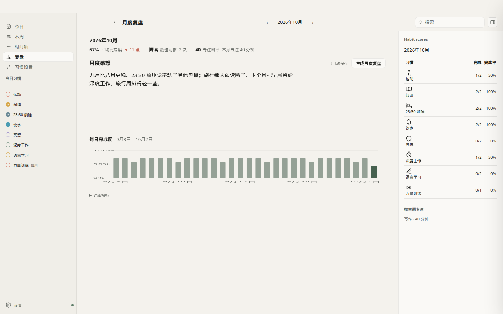
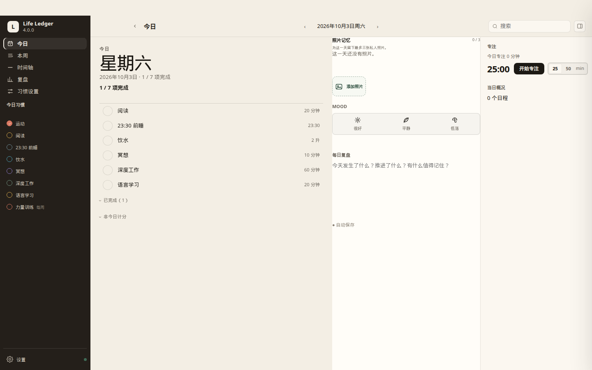
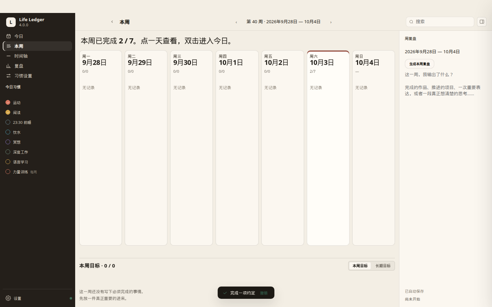
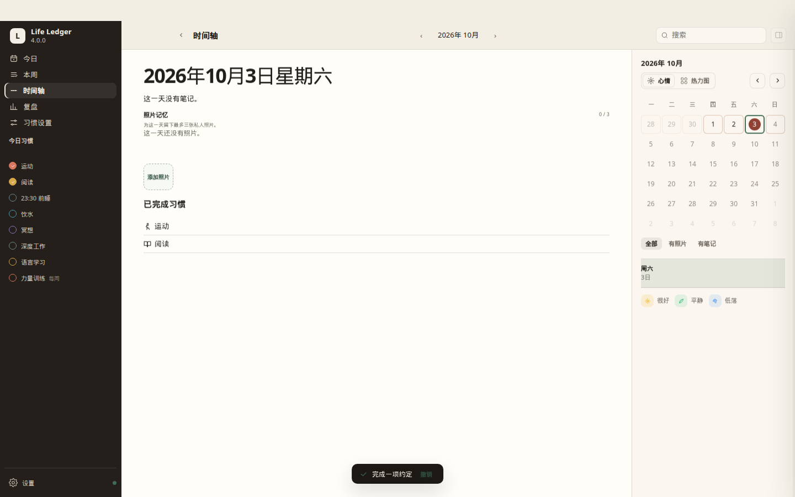
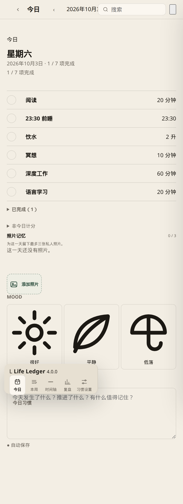
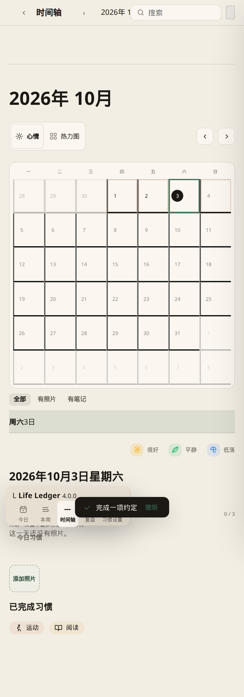
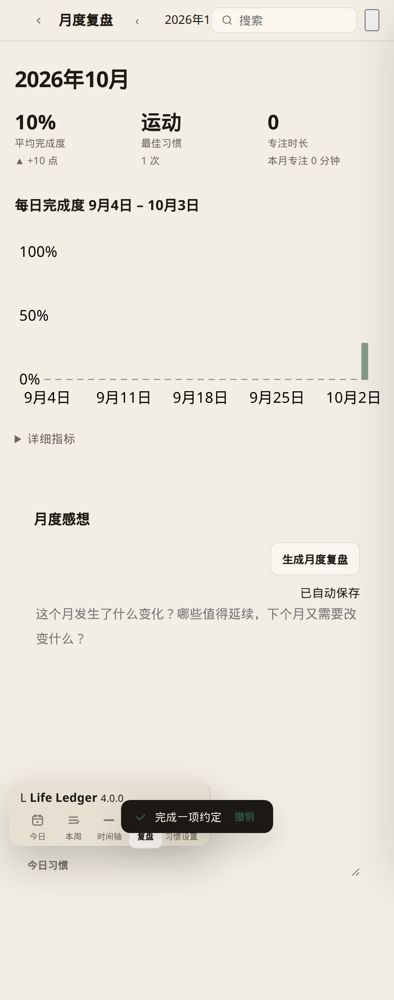

<div align="center">
  
  <h1>Life Ledger · 深度复盘</h1>
  <p><strong>理解过去，塑造未来。</strong></p>
  <p><em>一个帮助你理解过去，而不仅仅规划未来的个人深度复盘系统。</em></p>

  <p>
    <strong><a href="README.md">English</a></strong> ·
    <strong><a href="README.zh-CN.md">简体中文</a></strong> ·
    <strong><a href="README.de-DE.md">Deutsch</a></strong>
  </p>

  <p>
    <a href="https://zubin-li.github.io/life-ledger-deep-review/?mode=local&lang=zh">
      
    </a>
    <a href="https://github.com/zubin-li/life-ledger-deep-review/releases/latest">
      
    </a>
    <a href="docs/cloudbase-china.zh-CN.md">
      
    </a>
  </p>
</div>

<p align="center">
  
</p>

<p align="center">
  <strong>用三分钟说下今天，让日历、习惯、心情与记忆沉淀成一份私人复盘。</strong><br />
  <sub>可以立即在一个浏览器中使用，也可以自己部署，实现私密的跨设备同步。</sub>
</p>

<table>
  <tr>
    <td width="33%"><strong>轻松留下记录</strong><br />勾选习惯、读取日历背景，或把一段短语音整理成可编辑的复盘。</td>
    <td width="33%"><strong>看见完整轨迹</strong><br />从一天走到一周与一个月，在趋势之外保留真实的生活背景。</td>
    <td width="33%"><strong>始终掌握数据</strong><br />只存在本机、自己部署同步，或随时导出完整且可迁移的历史。</td>
  </tr>
</table>

<p align="center">
  <a href="https://zubin-li.github.io/life-ledger-deep-review/?mode=local&amp;lang=zh"><strong>立即体验私密版本</strong></a> ·
  <a href="https://github.com/zubin-li/life-ledger-deep-review/issues?q=is%3Aissue+is%3Aopen+label%3A%22help+wanted%22"><strong>一起共建下一版本</strong></a> ·
  <a href="https://github.com/zubin-li/life-ledger-deep-review/discussions"><strong>参与讨论</strong></a>
</p>

## 为什么是 Life Ledger？

很多效率工具关注的是：

> 下一步应该做什么。

Life Ledger 更关注的是：

> 你已经走过了怎样的路。

它用一种尽可能简单的方式，记录每天的习惯、状态、重点以及每周的思考，让那些原本容易被遗忘的日常，慢慢沉淀成一条属于自己的成长轨迹。

Life Ledger 不希望把生活变成一连串数字。

它希望帮助你更好地理解自己的成长。

随着时间积累，这些数据不再只是打卡记录，而会逐渐成为一份属于自己的成长历史。

Life Ledger 始终坚持一个原则：

> **你的数据属于你，你的人生记录也属于你。**

你可以完全在本地使用，也可以部署到自己的 Cloudflare，或者随时导出全部数据。

没有中心化账号，没有广告，也没有平台锁定。

## Deep Review（深度复盘）

Deep Review 是 Life Ledger 的核心理念。

它不是为了记录更多，而是为了帮助自己持续复盘。

每天留下少量记录。每周认真回顾一次。每个月重新理解自己。最终，把那些零散的日常连接成一条完整的人生成长轨迹。

复盘不是为了提高效率。

而是为了获得更清晰的自我认知。

## AI 辅助复盘

Life Ledger 负责记录，AI 帮助理解。

在自己部署的 Cloudflare 版本中，点击每日复盘里的**快速记录**，就可以把一段口述整理成清晰、可编辑的当日复盘。实时音量反馈会提示麦克风声音是否过轻；转写会把当前习惯、专注主题与目标作为私有词汇背景。Cloudflare Workers AI 会删除口语赘词，只在上下文高度明确时谨慎修正疑似识别错误，并且只基于你真正说过的内容重新组织表达；确认草稿后才会追加到今日日记。

不需要另外填写 AI API Key。录音只在处理期间短暂存在，不会进入 Life Ledger、D1、同步数据或备份；只有你主动确认保存的文字才会成为历史记录。

AI 不负责替你思考。它只是帮助你更好地看见自己。

> **部署说明：** AI 语音复盘仅在自己部署的 Cloudflare 版本开放；纯本机版与 CloudBase 版仍可完整使用普通记录功能。

## 主要功能

- 每日习惯、目标数值和生效日期管理
- 只读每日日历、心情、日记与事件记录
- 语音转写与 AI 整理，并在保存前编辑确认
- 本周目标、清单、本周输出和历史归档
- 月度复盘、习惯趋势对比、折线图与柱状图
- 经过验证的 JSON 备份、引导式恢复以及早期导出格式兼容
- 英文、简体中文和德语界面
- 浅色、深色和跟随系统模式
- 可安装 PWA 与离线应用外壳
- 可选的 Apple Silicon macOS 应用，支持纯本机与连接自有云端两种模式
- 可选的 Cloudflare Access + D1 跨设备同步
- 可选的只读 Google 日历，最多连接两个账号
- 心情颜色日历与可切换的完成度热力图
- Cloudflare 版本的私人照片记忆（支持 JPEG、PNG、WebP、HEIC、HEIF）、时间轴和按月 `.llmedia` 照片备份
- 桌面侧边栏中的精简长期待办
- 面向中国大陆的腾讯云 CloudBase 私有同步
- 面向电脑与手机的响应式 Apple 风格界面

<details>
<summary><strong>Life Ledger 1.3 已经带来了什么</strong></summary>

- 选择一个日期，顶部进度、习惯、心情、日程与复盘会一起切换。
- 最多连接两个只读 Google 日历账号，在不修改外部日程的前提下补充当天背景。
- 心情颜色、完成度热力图、压缩照片记忆与时间轴，让长期变化更容易被看见。
- 日历与复盘共享更安静的今日布局，专注计时收进复盘轮播。
- 快速记录生成可编辑的 AI 整理草稿，不会静默修改习惯、心情或目标。
- 可选的 Apple Silicon macOS 应用既可以完全本机使用，也可以打开自己部署的 Life Ledger；本机模式提供原生 JSON 备份窗口。

[查看完整版本说明 →](https://github.com/zubin-li/life-ledger-deep-review/releases/tag/v1.3.0)

</details>

## 产品展示

<table>
  <tr>
    <td width="50%"></td>
    <td width="50%"></td>
  </tr>
  <tr>
    <td><strong>每日更清楚</strong><br />直接查看当天真实日程，并在旁边留下复盘，不再重复规划。</td>
    <td><strong>每周有方向</strong><br />把必须完成的工作与本周输出放在同一个安静、清晰的空间里。</td>
  </tr>
</table>

<p align="center">
  
</p>
<p align="center"><strong>一条只属于自己的记忆线。</strong> 回看心情、语境和压缩后的照片记忆，而不是把生活变成公开动态。</p>

<p align="center">
  
  
  
</p>

<p align="center"><strong>为手机重新排版。</strong> 安装为 PWA 后使用底部导航；单日打卡与日记在小屏幕上变成专注的纵向复盘空间。</p>

<p align="center"><a href="docs/SHOWCASE.zh-CN.md"><strong>查看完整桌面与手机产品图集 →</strong></a></p>

<sub>截图采用虚构的 2026 年 7 月演示数据，不包含真实个人记录。</sub>

## 选择使用方式

| 方式 | 适合谁 | 必须买域名 | 起步费用 |
|---|---|---:|---:|
| 仅本机 PWA | 单设备、无需配置 | 否 | 0 元 |
| Cloudflare + D1 | 国际网络环境下自托管 | 否 | 免费额度 |
| 腾讯云 CloudBase | 中国大陆访问与跨设备同步 | 个人体验不需要 | 免费体验环境 |
| macOS 桌面 MVP（Tauri） | 原生 Mac 外壳 + 本机/云端二选一 | 否 | 本地构建 |

### 1. 立即使用——无需配置

在现代浏览器中打开 **[Life Ledger 仅本机版](https://zubin-li.github.io/life-ledger-deep-review/?mode=local&lang=zh)**。不需要账户、下载、终端、Node.js 或云端配置。

记录会自动保存在当前设备的当前浏览器中。手机上可通过浏览器菜单选择**添加到主屏幕**或**安装应用**，获得全屏 PWA 体验，并让应用外壳可以离线打开。

更换设备、浏览器或浏览器资料前，请打开**备份与恢复**，选择**全部历史**并导出，把 JSON 文件私下转移到新设备后再恢复。相同网址不会让两台设备自动同步；需要实时跨设备同步时，请选择下面的 Cloudflare 或 CloudBase 方案。完整说明见[备份与恢复指南](docs/backup-and-restore.zh-CN.md)。

#### 电脑离线预览

GitHub ZIP 仍可用于查看源代码和电脑端预览：点击 **Code → Download ZIP**，解压后打开 `OPEN-LIFE-LEDGER.html`。直接文件模式会主动关闭 PWA 安装、Service Worker 缓存和云同步，不建议把它作为 iPhone 或 Android 的长期记录方式。

如果希望使用更稳定的浏览器本地域名，同时又不安装项目依赖，可以在仓库目录运行一个轻量本地服务器：

```bash
python3 -m http.server 4173 --directory public
```

然后打开 `http://localhost:4173`。

### 2. 开发者模式

```bash
git clone https://github.com/zubin-li/life-ledger-deep-review.git
cd life-ledger-deep-review
npm install
npm run dev
```

打开 Wrangler 显示的本地网址。首次启动会建立本地 D1 结构；这个模式主要用于修改 Worker API 或测试 D1 集成。

### 3. 建立自己的 GitHub 副本

点击 GitHub 页面上的 **Use this template**。生成的新仓库拥有独立历史，可以自行修改，不会把任何个人数据分享给本项目。

### 4. 使用 Cloudflare 部署

点击上面的 **Deploy to Cloudflare**。Cloudflare 会把公开仓库复制到你的账号，在你的账户中创建 Worker 和 D1 数据库，执行初始化并完成部署。

部署完成后启用 Cloudflare Access：

1. 进入 Cloudflare 的 **Workers & Pages**。
2. 打开新建的 `life-ledger-deep-review` Worker。
3. 进入 **Settings → Domains & Routes**。
4. 在 `workers.dev` 地址旁点击 **Enable Cloudflare Access**。
5. 只允许你自己的邮箱或可信任的家庭成员。
6. 复制 Access 应用的 **Application Audience (AUD) Tag**。
7. 在 Worker 的 **Settings → Variables and Secrets** 中添加：`TEAM_DOMAIN` 填写 `https://<你的团队名>.cloudflareaccess.com`，`POLICY_AUD` 填写刚才复制的 AUD。
8. 打开应用并完成一次验证，之后云同步会使用经过验证的 Access 身份。

同一次部署会自动包含“快速记录”使用的 Workers AI 绑定。为了让个人免费使用更可控，每个账号每天最多处理 3 段、累计 20 分钟的录音，单次最长 10 分钟。Cloudflare 的免费额度和价格可能调整；如果要开放给多人使用，请先查看自己的 Cloudflare 用量面板。

Cloudflare 版本还可以以只读方式连接 Google 日历，并把压缩后的照片记忆保存在自己的私有 R2 存储中。Google 日历需要使用者创建自己的 OAuth 网页客户端，并配置四个 Cloudflare Secret；仓库不会内置或共享任何 Google 凭据。完整步骤和隐私边界见[自托管说明](docs/self-hosting.zh-CN.md)。

完整步骤请看[自托管说明](docs/self-hosting.zh-CN.md)和[Cloudflare Access 设置](docs/cloudflare-access.zh-CN.md)。

### 5. 在中国大陆使用腾讯云 CloudBase 部署

CloudBase 是本项目推荐的中国大陆方案：网页、邮箱验证码身份认证和文档型数据库都位于部署者自己的腾讯云环境中。

个人自用可以直接使用系统分配的 `*.tcloudbaseapp.com` 地址，开始阶段不需要购买域名，也不需要为自己的域名办理 ICP 备案。截至 2026 年 8 月，免费体验环境每月提供 3000 资源点，不支持按量付费，因此不会因超出免费额度自动扣费；它需要每 6 个月手动续期，未来政策仍以腾讯云官方页面为准。

仓库已经包含完整的可运行实现：

- 当前 CloudBase CLI 使用的 `cloudbaserc.json`；
- 基于 CloudBase Web SDK v3 的同步适配器；
- Git 部署构建命令 `npm run build:cloudbase`；
- 本地一条命令部署 `npm run deploy:cloudbase`。

首次只需在自己的控制台完成三项安全配置：创建免费文档数据库环境、开启邮箱验证码、创建 `life_ledger_states` 并选择**仅创建者可读写**。这三步涉及账户管理权限，不能安全地放到网页代码中自动执行，否则就必须暴露管理员密钥。

请按[中国大陆 CloudBase 完整部署指南](docs/cloudbase-china.zh-CN.md)操作；英文说明见 [Mainland China deployment guide](docs/cloudbase-china.md)。

### 6. macOS 桌面 MVP（可选外壳）

仓库已包含首个 Tauri v2 的 macOS 外壳，提供两个明确入口：

- **本机模式**：打开内置前端，不需要账号，保持本地优先存储。
- **连接云端**：只打开你自己填写并通过校验的 Life Ledger 部署地址。

在桌面本机窗口中，JSON 备份导入/导出使用 macOS 原生文件对话框，可直接选择 iCloud Drive 文件夹。这里的能力是“文件备份转移”，不是实时同步、冲突合并或自动双向同步。

本机桌面应用还可以把今日习惯发布到一个真正原生的 macOS WidgetKit 小组件（桌面或通知中心），带有原生勾选框，即使应用未打开也能使用。小组件永远不会显示日记或心情原因，也不会改变已连接云端窗口的安全边界。架构与构建步骤见 [docs/macos-widget.md](docs/macos-widget.md)（英文）。

应用外壳呈现原生 macOS 观感：真实的交通灯按钮位于透明标题栏中，侧边栏贴边展示，不再有“网页嵌套卡片”的边框；一个低调的 **本地 Mac** / **已连接云端** 状态标签取代了 PWA 安装提示，后者在浏览器外始终保持隐藏。标准快捷键在非可编辑区域可用——Cmd+1 至 Cmd+5 分别对应今日/本周/时间轴/复盘/习惯设置，Cmd+B 切换侧边栏，Cmd+, 打开设置窗口，Cmd+Shift+E 打开备份与导出——且不会更改公开 PWA 中的任何快捷键。启动器改为紧凑的原生工作区选择界面，窗口位置与大小会在每次启动时被记住。

构建命令与未签名应用的 Gatekeeper 处理见 [docs/macos-desktop.md](docs/macos-desktop.md)。

### 7. Life Ledger 2.0——一套安静的仪表盘式设计

3.3 版本去掉了常驻的右侧检查器。今日只做一件事：日期、一行进度、紧凑的心情，以及“回顾今天”里的笔记和照片。专注在工具栏里，从同一个按钮展开。侧边栏是今日、本周、日志、洞察和习惯。日志把时间线、照片和日历收成同一种列表与详情。洞察是一列阅读：最多三个摘要、完成趋势、一致性热力和习惯对比。版本仍然只出现在设置的关于里。

3.2 版本按任务重排桌面。今日使用 12 栏：习惯和感想占较宽的一栏，心情和照片占较窄的一栏，专注仍在检查器里。侧边栏只有一个滑动的当前项，⌘K 打开命令面板，用来跳转视图、日期、习惯和设置。复盘先给出 7/30/90 天的摘要、趋势和热力。版本仍然只出现在设置的关于里。

3.1 版本保留桌面三栏结构（宽度 980px 及以上），并恢复冷静的鼠尾草绿与纸色。安装版本只出现在设置的关于里。今日是左右两栏：左侧是习惯列表，右侧更宽的纸页放当天的照片、心情和文字。本周是横跨窗格的七天列。时间轴把日记页放在左侧、月历放在右侧。复盘先给出本地的 7/30/90 天统计：完成数除以可计入的天数、连续天数、趋势和一致性热力，然后才是月度感想。习惯是一组可管理的行。语言可以跟随系统、English、简体中文或 Deutsch，选择后立即生效。照片仍默认留在这台设备上；登录的是 Cloudflare 工作区时仍走原来的照片接口，选定月份也可以连同照片导出。本机 Mac 窗口会注销旧的 Service Worker，并只删除应用自己的缓存，日记、习惯和照片都保留。Mac 应用保留应用菜单（App、文件、编辑、显示、窗口、帮助）：Cmd+, 打开独立设置窗口，Cmd+N 新建习惯，Cmd+F 搜索，Cmd+1–5 切换视图，Cmd+B 切换侧边栏，Cmd+Option+0 切换检查器，Cmd+T / Cmd+[ / Cmd+] 切换日期，Cmd+Shift+E 备份与导出；启动时直接打开上次工作区（本机或已连接云端），可通过“文件 → 切换工作区…”更换。手机与窄屏浏览器布局、数据、备份、同步、语言和主题保持兼容。

2.0 版本带来了一次覆盖网页版、PWA 与 macOS 外壳的完整界面重新设计，而不只是桌面端的一层皮肤。侧边栏、工具栏，以及今日、本周、时间轴、复盘、习惯设置这五个视图，现在共享同一套克制的设计系统：系统字体排版（界面本身不再使用装饰性衬线字体或网络字体）、4px 间距刻度、6–14px 的圆角刻度取代此前 18–30px 的"卡片"观感，阴影只保留给悬浮的对话框、弹出面板与日记抽屉，不再铺满每一张内嵌卡片。此前残留的文字符号/表情图标（导航、心情选择、对话框关闭按钮、展开折叠箭头、轮播与日历箭头）现在统一替换为本地内联 SVG 图标系统；鼠标悬停与按下的反馈也改为即时的边框或背景变化，去掉了此前跟随鼠标的倾斜/光晕效果。浅色与深色外观各自独立调校，动效继续遵循 `prefers-reduced-motion`。现有数据、本地/连接云端模式、备份导入导出、语言、主题、键盘快捷键、日历、习惯、专注与复盘的行为均未改变。

## 数据归属

```text
浏览器 / 已安装的 PWA
   ├── localStorage     即时本地保存
   ├── JSON 备份        验证导出 + 引导恢复
   └── 可选的身份验证同步
            ├── Cloudflare Worker → 你自己的 D1
            └── CloudBase Web SDK → 你自己的文档集合
```

云同步不是必需功能。仅本机版在每台设备和每个浏览器资料中各自保存一份数据；清理网站数据可能删除记录，因此应保留带日期的完整备份。Cloudflare 方案验证 Access JWT 后写入 D1；CloudBase 方案使用登录会话和“仅创建者可读写”的集合权限。日记内容没有进行应用层端到端加密，因此相应云账户的管理员可以查看自己数据库中的记录。保存敏感信息前请阅读 [PRIVACY.md](PRIVACY.md)。

## 常用命令

| 命令 | 用途 |
|---|---|
| `npm run dev` | 执行本地迁移并启动 Wrangler 开发环境 |
| `npm test` | 执行语法、隐私标记、结构和 Worker 测试 |
| `npm run check` | 快速检查仓库 |
| `npm run build:cloudbase` | 使用 `TCB_ENV_ID` 与 `TCB_ACCESS_KEY` 构建 CloudBase 发布文件 |
| `npm run deploy:cloudbase` | 构建并部署到腾讯云 CloudBase 静态网站托管 |
| `npm run db:migrations:apply` | 对远程 D1 执行数据库迁移 |
| `npm run deploy` | 执行迁移并部署到 Cloudflare |

开发和部署命令需要 Node.js 20 或以上版本；直接本地使用不需要安装 Node.js。

## 项目结构

```text
public/       浏览器应用、PWA、同步适配器和视觉资源
src/          Cloudflare Worker API 与静态资源路由
migrations/   D1 数据库结构
scripts/      仓库检查与 CloudBase 构建/部署工具
tests/        轻量 Worker 测试
docs/         自托管和数据说明
.github/      CI 与 Issue 模板
```

## 费用预期

Life Ledger 面向个人或小型家庭使用，两种云方案都运行在部署者自己的账户中。正常个人记录量预计能留在免费额度内，但云厂商的规则和价格可能变化。

中国大陆方案目前可使用一个每月 3000 资源点的 CloudBase 免费体验环境；它不支持按量付费，需要每 6 个月手动续期。系统默认域名被官方定位为开发/测试用途；只有以后面向公众正式运营，才需要自有域名、满足条件的付费环境和 ICP 备案。详见[费用与域名决策表](docs/cloudbase-china.zh-CN.md#费用与域名决策)。

## 后续计划

- [可打印、可保存为 PDF 的周度与月度报告](https://github.com/zubin-li/life-ledger-deep-review/issues/2)
- [保护隐私的 AI 架构](https://github.com/zubin-li/life-ledger-deep-review/issues/3)与[可编辑的阶段复盘草稿](https://github.com/zubin-li/life-ledger-deep-review/issues/4)
- [可持续维护的全平台 App 路线](https://github.com/zubin-li/life-ledger-deep-review/issues/1)
- 更安全的编辑冲突处理、长期数据扩展、无障碍测试与社区翻译

完整的优先级、隐私边界和明确不做的事项，请参阅[产品路线图](docs/ROADMAP.md)。路线图表达的是产品方向，不代表已经承诺发布日期。

## 参与贡献

Life Ledger 正在寻找关注本地优先软件、谨慎使用 AI、全平台体验、数据可视化、无障碍和多语言设计的贡献者。

- 从带有 [`help wanted`](https://github.com/zubin-li/life-ledger-deep-review/issues?q=is%3Aissue+is%3Aopen+label%3A%22help+wanted%22) 标签且范围清晰的任务开始。
- 第一次参与时，可以选择 [`good first issue`](https://github.com/zubin-li/life-ledger-deep-review/issues?q=is%3Aissue+is%3Aopen+label%3A%22good+first+issue%22)。
- 开放式产品想法请放在 [Discussions](https://github.com/zubin-li/life-ledger-deep-review/discussions)，明确的开发任务请使用 Issues。

提交前请阅读 [CONTRIBUTING.md](CONTRIBUTING.md)、[SECURITY.md](SECURITY.md)和[更新记录](CHANGELOG.md)。不要在公开 Issue 中上传私人日记导出文件。

## 开源协议

Life Ledger 使用 [MIT License](LICENSE)。改编的 Lucide 图标路径说明见 [THIRD_PARTY_NOTICES.md](THIRD_PARTY_NOTICES.md)。
