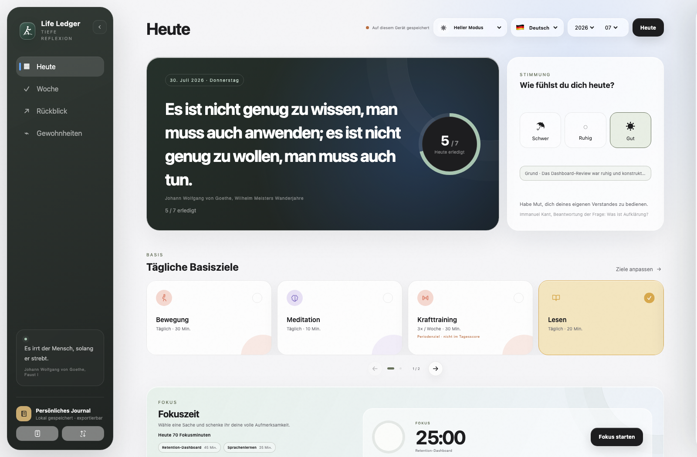
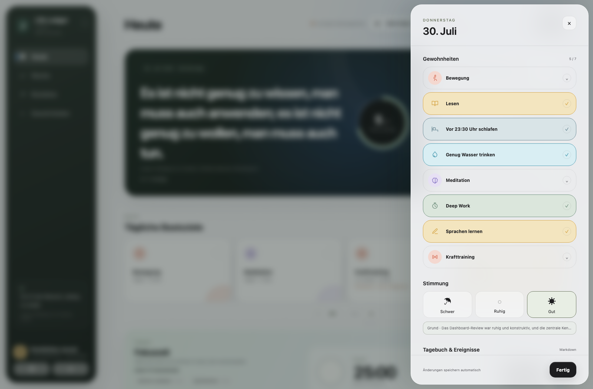
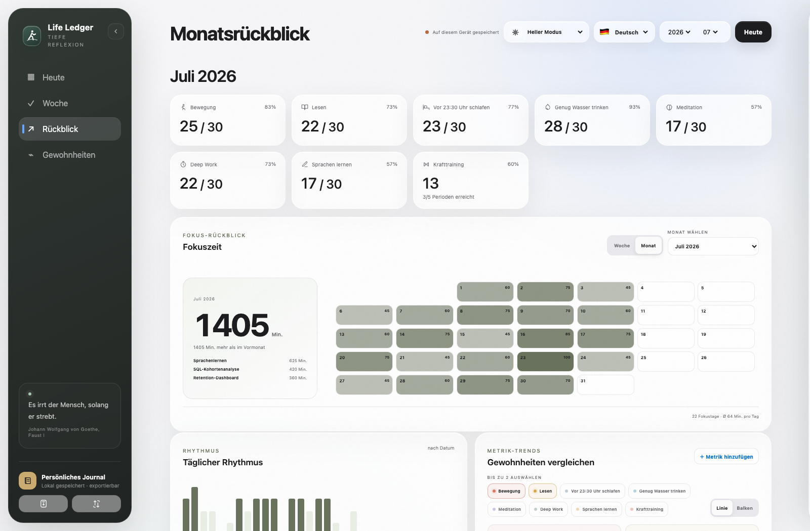
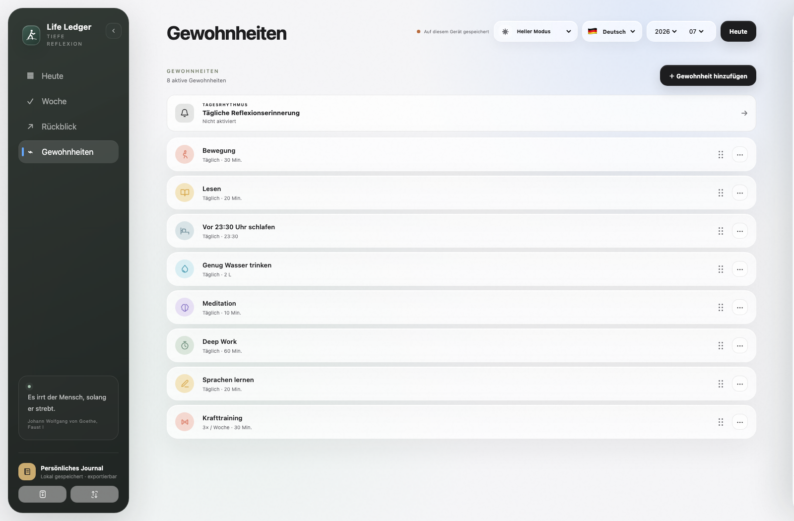
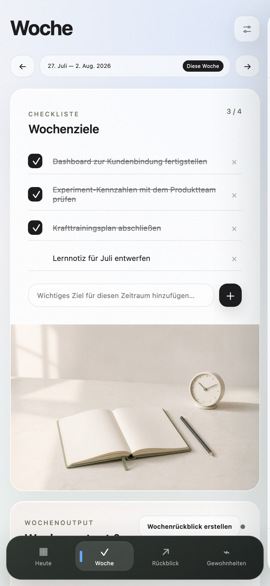
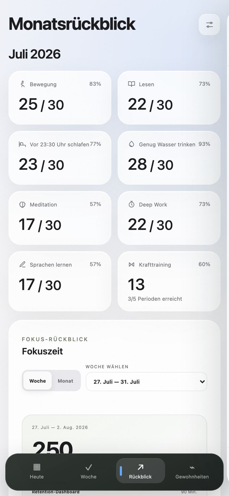
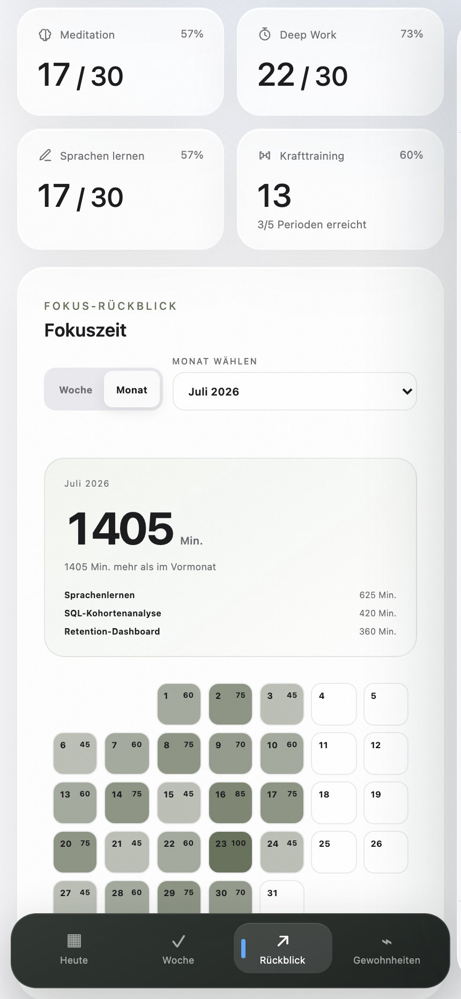
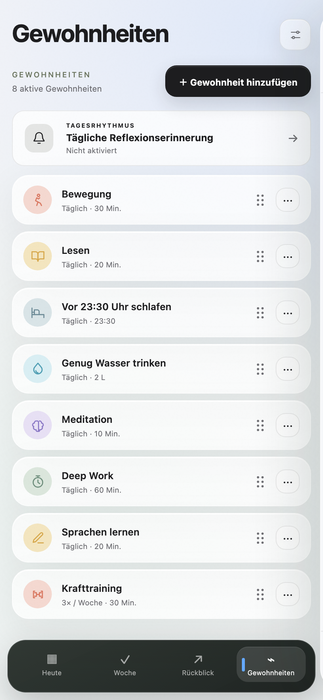

# Life Ledger Produktübersicht

[English](SHOWCASE.md) · [简体中文](SHOWCASE.zh-CN.md) · [Deutsch](SHOWCASE.de-DE.md) · [Zur deutschen README](../README.de-DE.md)

Life Ledger verbindet tägliche Gewohnheiten, konkrete Planung und ausführliche Reflexion in einem lokalen, selbstbestimmten Arbeitsbereich. Alle Screenshots enthalten ausschließlich fiktive Beispieldaten aus dem Juli 2026.

## Desktop

### Heute: planen und reflektieren

Konkrete Ziele und eine bearbeitbare Tagesreflexion stehen nebeneinander; der vollständige Monatskalender bleibt darunter sichtbar.

### Tagesrückblick

Öffne einen vergangenen oder den aktuellen Tag, um Gewohnheiten, Stimmung und Notizen zu ergänzen, ohne den Monat zu verlassen.

### Woche: Vorhaben und Rückblick

Erledigte Wochenziele bleiben als sichtbarer Fortschritt erhalten. Der Rückblick bietet ausreichend Raum für zusammenhängende Gedanken.

### Monatsrückblick: Zahlen im Zusammenhang

Die Auswertung berücksichtigt alle aktiven Gewohnheiten, auch periodische Ziele wie Krafttraining. Bis zu zwei Gewohnheiten lassen sich als Linien- oder Balkendiagramm vergleichen.

### Fokus: sehen, wohin die Zeit geflossen ist

Vergleiche Fokusminuten nach Thema und erkenne deinen Rhythmus in einer Monats-Heatmap – ohne Fortschritt auf Session-Zahlen zu reduzieren.

### Gewohnheiten: Regeln dürfen sich entwickeln

Gewohnheiten können täglich, wöchentlich oder monatlich gelten, in die Tageswertung einfließen oder davon ausgenommen werden und sich ab einem gewählten Datum ändern, ohne die Historie umzuschreiben.

## Mobil

Die mobile Oberfläche verwendet eine feste Navigation am unteren Rand und macht den Tagesrückblick zu einem fokussierten, nahezu bildschirmfüllenden Bereich.

<table>
  <tr>
    <td width="33%"></td>
    <td width="33%"></td>
    <td width="33%"></td>
  </tr>
  <tr>
    <td align="center"><strong>Heute</strong></td>
    <td align="center"><strong>Tagesrückblick</strong></td>
    <td align="center"><strong>Woche</strong></td>
  </tr>
  <tr>
    <td width="33%"></td>
    <td width="33%"></td>
    <td width="33%"></td>
  </tr>
  <tr>
    <td align="center"><strong>Rückblick</strong></td>
    <td align="center"><strong>Fokus</strong></td>
    <td align="center"><strong>Gewohnheiten</strong></td>
  </tr>
</table>

## Weiter

- [Life Ledger jetzt auf Deutsch verwenden](https://zubin-li.github.io/life-ledger-deep-review/?mode=local&lang=de)
- [Auf Cloudflare selbst hosten](self-hosting.md)
- [Cloudflare Access konfigurieren](cloudflare-access.md)
