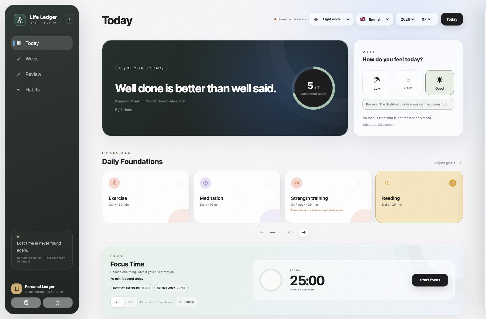
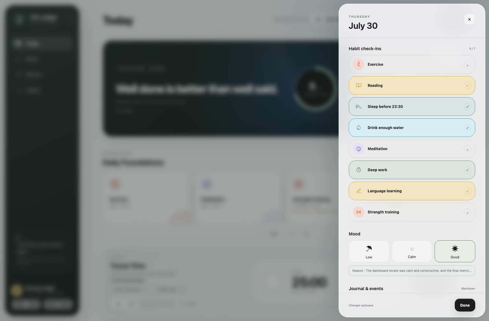
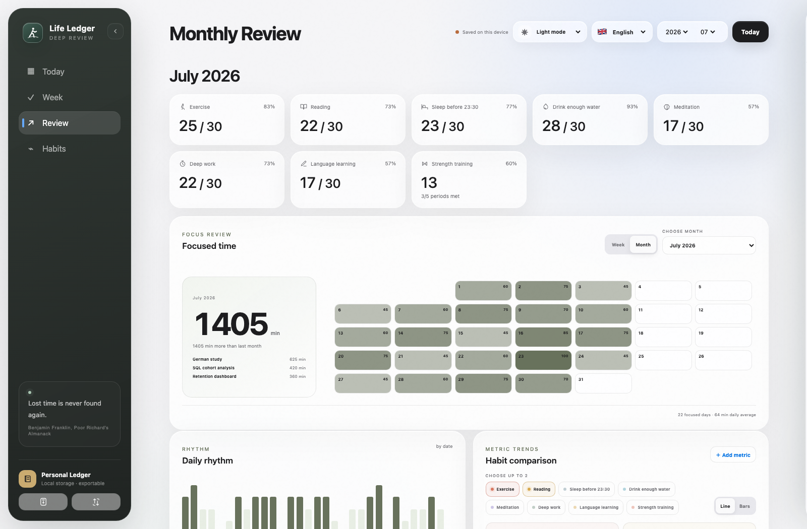
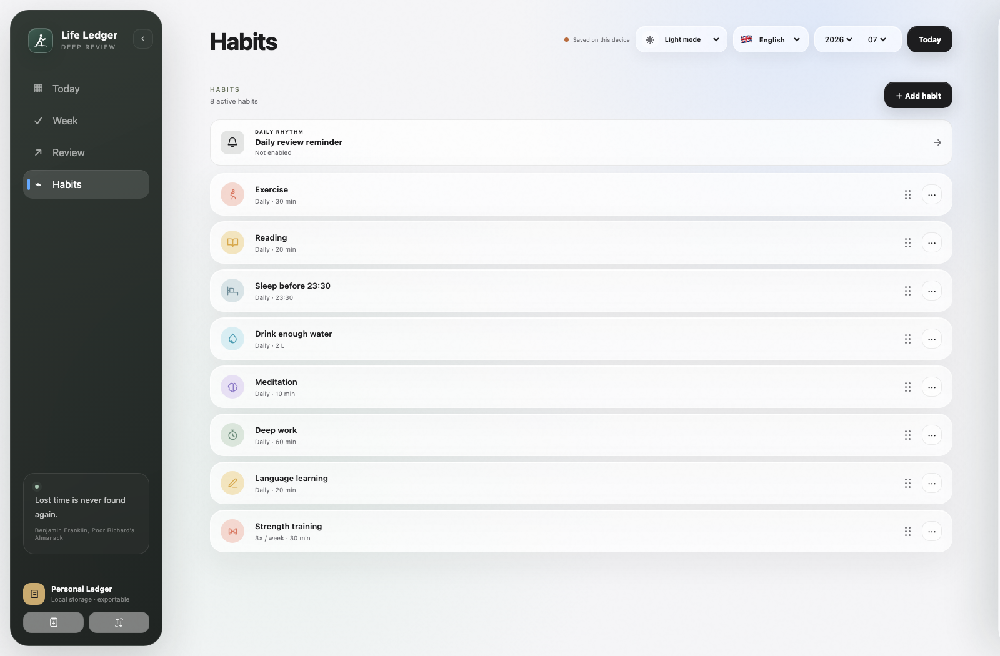
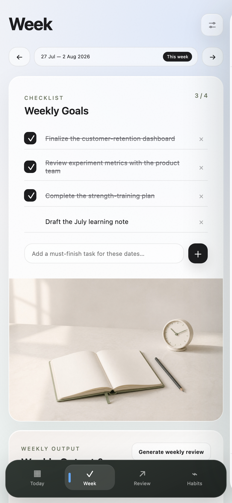
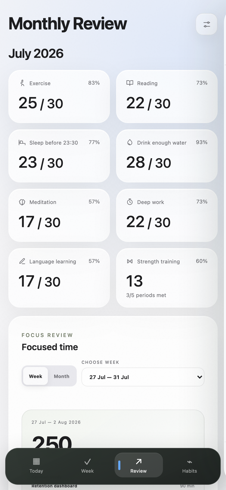
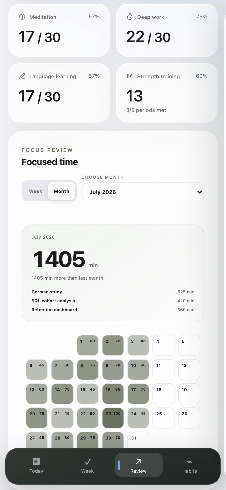
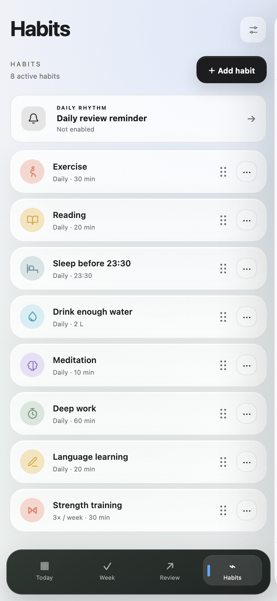

# Life Ledger product showcase

[English](SHOWCASE.md) · [简体中文](SHOWCASE.zh-CN.md) · [Deutsch](SHOWCASE.de-DE.md) · [Back to README](../README.md)

Life Ledger brings daily habits, practical planning, and long-form reflection into one local-first workspace. The screenshots below use fictional July 2026 data created only for demonstration.

## Desktop experience

### Today: plan and reflect

The selected day keeps concrete goals and an editable reflection side by side, with the month remaining visible underneath.

### Daily review

Open any past or current calendar day to review habit check-ins, mood, and journal notes without leaving the month.

### Week: commitments and output

Weekly goals behave like a reminder list: completed work stays visible as evidence. The output area provides room for a narrative review.

### Review: numbers with context

Monthly statistics include every active habit, including period-based goals such as resistance training. Compare up to two habits with line or bar views, then write the reflection beneath the data.

### Focus: see where the time went

Compare focus minutes by topic and see the month as a heatmap, without reducing progress to session counts.

### Habits: rules that can evolve

Habits can use daily, weekly, or monthly rules, include or exclude themselves from the daily score, and change from an effective date without rewriting history.

## Mobile experience

The mobile layout uses persistent bottom navigation and turns the daily drawer into a focused, full-height review.

<table>
  <tr>
    <td width="33%"></td>
    <td width="33%"></td>
    <td width="33%"></td>
  </tr>
  <tr>
    <td align="center"><strong>Today</strong></td>
    <td align="center"><strong>Daily review</strong></td>
    <td align="center"><strong>Week</strong></td>
  </tr>
  <tr>
    <td width="33%"></td>
    <td width="33%"></td>
    <td width="33%"></td>
  </tr>
  <tr>
    <td align="center"><strong>Review</strong></td>
    <td align="center"><strong>Focus</strong></td>
    <td align="center"><strong>Habits</strong></td>
  </tr>
</table>

## Continue

- [Use Life Ledger now](https://zubin-li.github.io/life-ledger-deep-review/?mode=local&lang=en)
- [Self-host on Cloudflare](self-hosting.md)
- [Configure Cloudflare Access](cloudflare-access.md)
