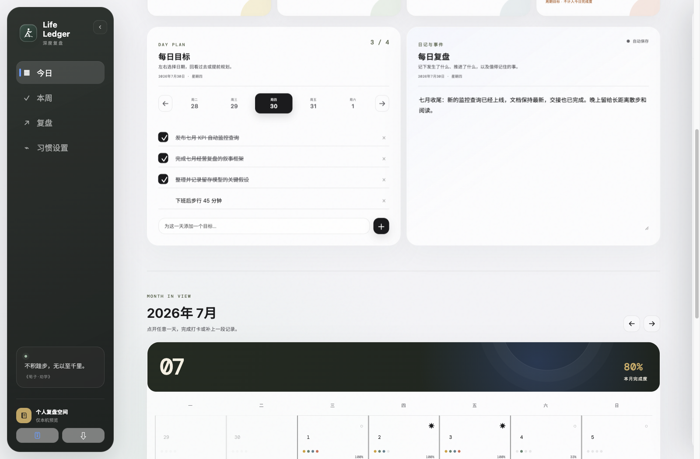
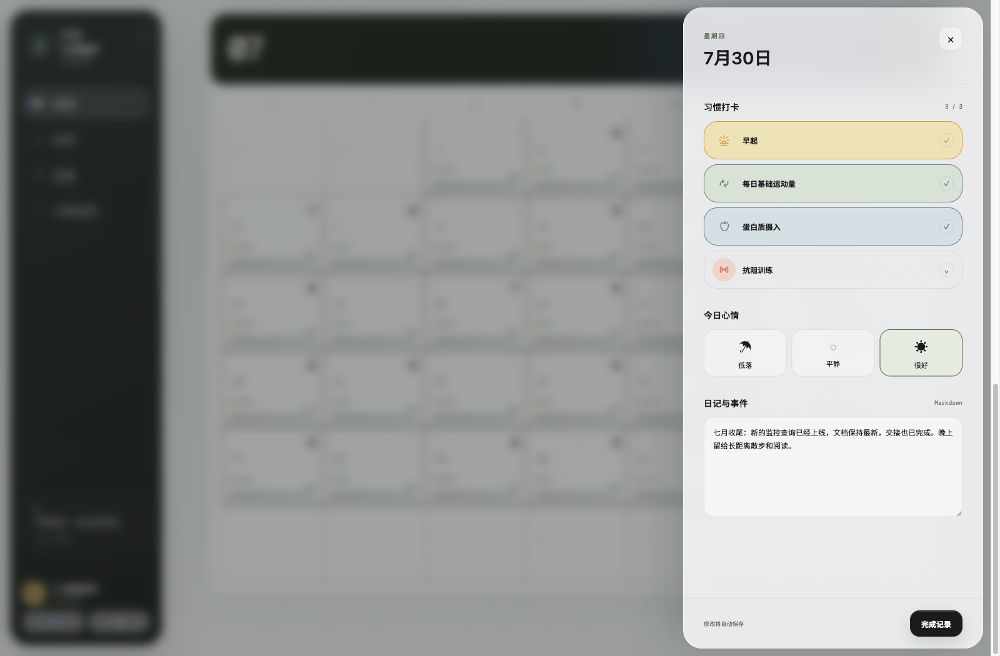
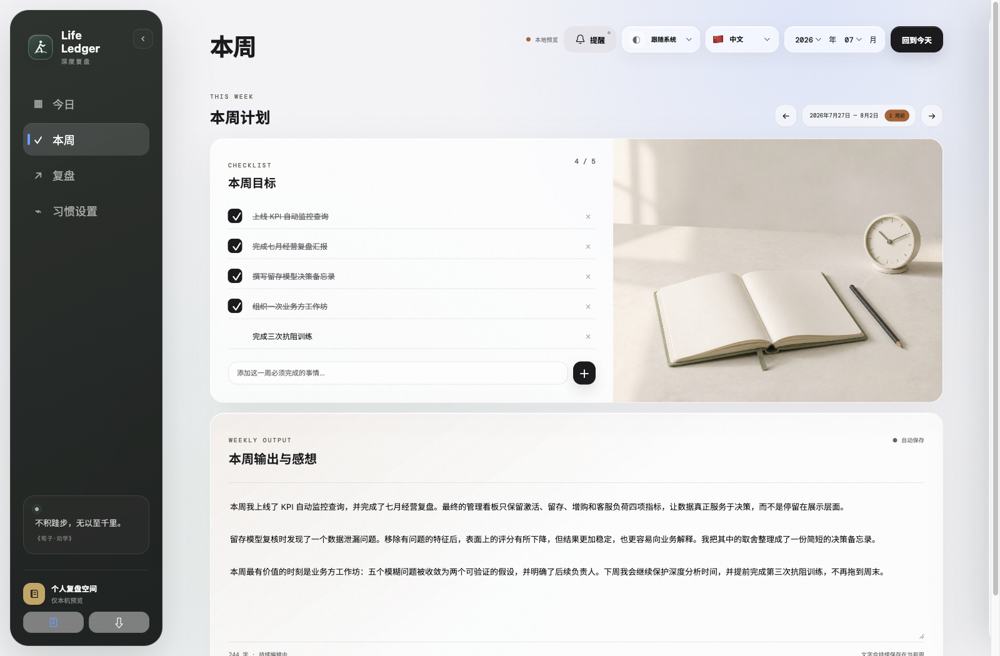
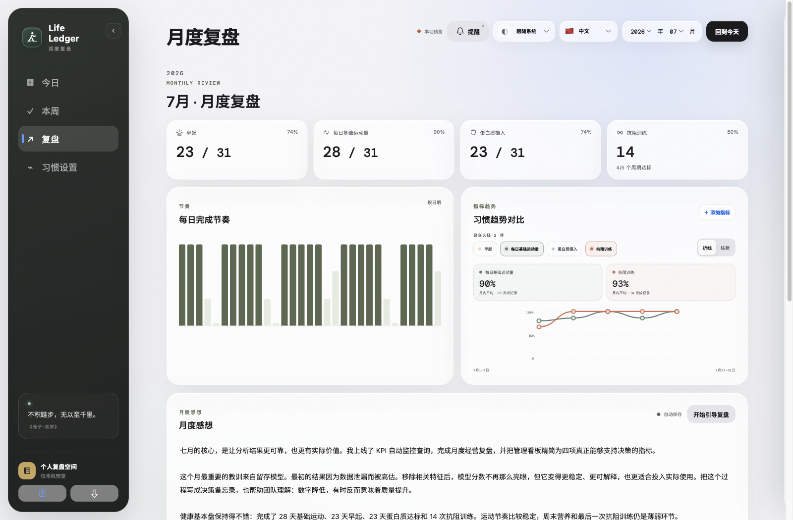
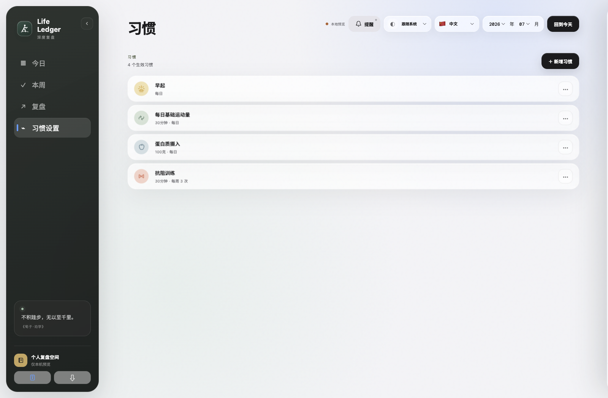
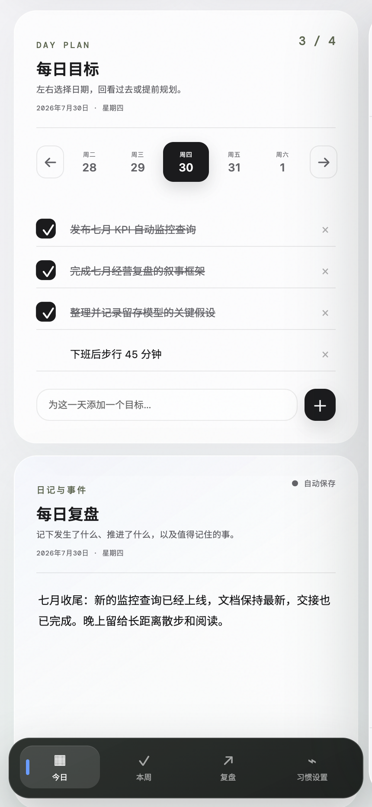
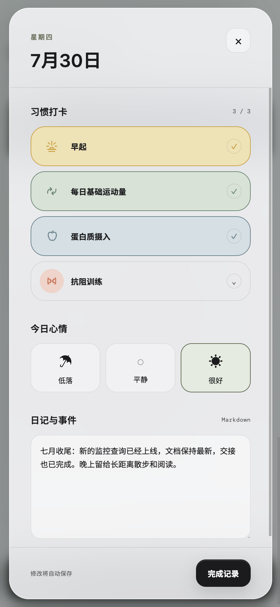
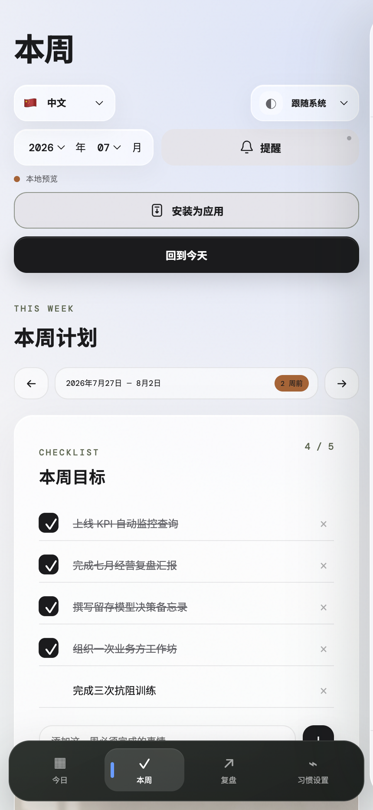
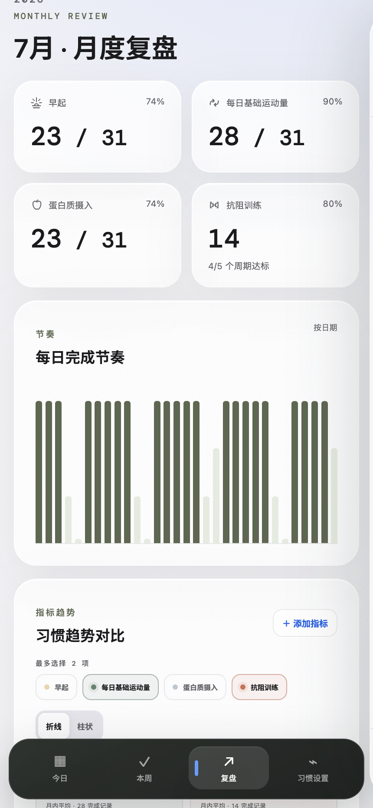
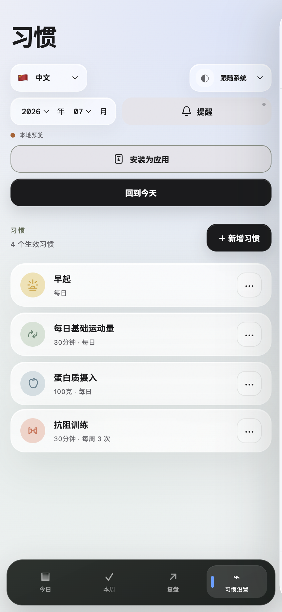

# Life Ledger 产品展示

[English](SHOWCASE.md) · [简体中文](SHOWCASE.zh-CN.md) · [返回中文 README](../README.zh-CN.md)

Life Ledger 把每日习惯、具体计划和长期复盘放进同一个本地优先空间。以下截图使用虚构的 2026 年 7 月数据，仅用于产品演示。

## 桌面体验

### 今日：计划与复盘

选中某一天后，具体目标和可编辑的每日复盘并排呈现，下方仍然保留完整月历。

### 单日记录

点击日历中的过去或当天，即可查看习惯打卡、心情和日记，不必离开当前月份。

### 本周：承诺与输出

本周目标采用提醒事项式交互：完成后保留划线记录，作为真实推进的证据；下方提供完整的本周输出空间。

### 复盘：让数据回到生活语境

月度统计覆盖全部生效习惯，也包括抗阻训练等周期目标。最多可以选择两个习惯，以折线或柱状形式对比，再在数据下方完成文字复盘。

### 习惯：规则可以成长

习惯支持每日、每周和每月规则，可以决定是否计入每日完成度，也可以从指定日期开始调整目标而不改写历史。

## 手机体验

手机布局采用固定底部导航，并把单日抽屉变成专注、接近全屏的纵向复盘空间。

<table>
  <tr>
    <td width="33%"></td>
    <td width="33%"></td>
    <td width="33%"></td>
  </tr>
  <tr>
    <td align="center"><strong>今日</strong></td>
    <td align="center"><strong>单日复盘</strong></td>
    <td align="center"><strong>本周</strong></td>
  </tr>
  <tr>
    <td width="33%"></td>
    <td width="33%"></td>
    <td width="33%" valign="middle"><strong>可安装，本地优先</strong>  把 Life Ledger 安装为 PWA；数据可以留在浏览器、导出为 JSON 备份，或同步到你自己的 Cloudflare Access 与 D1。</td>
  </tr>
  <tr>
    <td align="center"><strong>复盘</strong></td>
    <td align="center"><strong>习惯</strong></td>
    <td></td>
  </tr>
</table>

## 继续了解

- [直接在本地运行](../README.zh-CN.md#1-仅在本地使用下载后直接打开)
- [部署到自己的 Cloudflare](self-hosting.zh-CN.md)
- [配置 Cloudflare Access](cloudflare-access.zh-CN.md)
